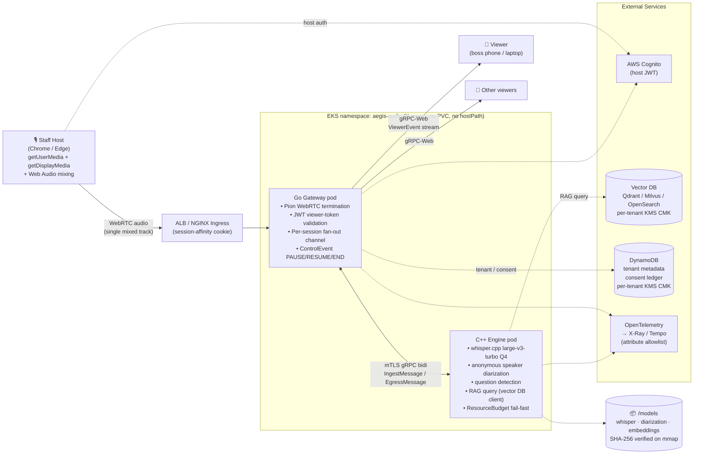
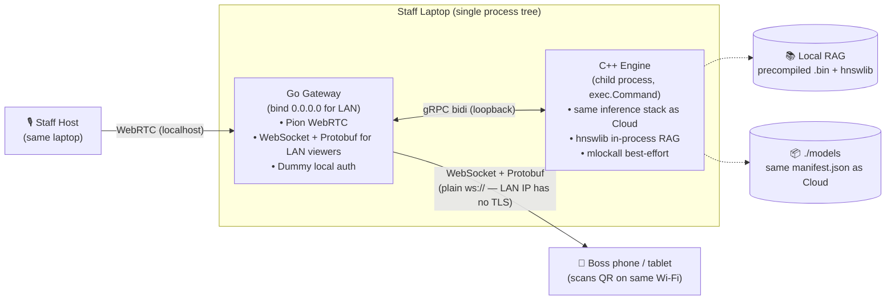

# 🛡️ Aegis Core (V2 Enterprise)

## System Architecture Blueprint

This document defines the core architecture, technical stack, and design decisions for the Aegis Core (V2).
**ALL future AI agents must consult and update this document when making systemic changes.**

### 1. System Topology & Tech Stack
The architecture is designed as a **Microservice + BFF (Backend For Frontend)** topology, optimized for EKS deployment and ultra-low latency.

*   **Core Engine (C++)**:
    - pure backend service handling inference.
    - Uses `whisper.cpp` / ML accelerators (Metal/CUDA).
    - Exposes a raw native **gRPC** server.
*   **API Gateway / BFF (Go)**:
    - Built with Go.
    - Handles external WebRTC (via `Pion`) and terminates network logic.
    - Translates gRPC-Web from frontend into native gRPC for C++.
*   **Web Client / App (React + Tauri)**:
    - Frontend built with React.
    - Uses `gRPC-Web` to communicate with the Go GW strong-typed APIs.
    - Deployed as static assets (CloudFront/S3) OR packaged as a lightweight Mac/Win desktop app via **Tauri (Rust)** to access native OS microphones/audio out.
*   **Build System (Bazel Monorepo)**:
    - Entire project exists in a single Bazel Monorepo.
    - `.proto` files are stored at the root, generating strong-typed SDKs for C++, Go, and TS simultaneously.

#### 1.1 System Diagram (Cloud Mode)

#### 1.2 System Diagram (Local Mode)

Notes on the diagrams:

- **No persistent meeting content on the server**. In both modes the
  Go Gateway holds only a session registry + a bounded fan-out
  channel. Transcripts live on the host device only. See §9.1
  Layered Privacy Model and
  [ADR-0004](docs/adr/0004-stateless-broadcast-relay.md).
- **Single-channel diarization** means we capture one mixed audio
  track. This decouples capture mechanics from speaker identification
  and unlocks pure-web MVP capture via `getUserMedia` +
  `getDisplayMedia` ([ADR-0003](docs/adr/0003-host-audio-capture-strategy.md)).
- **Dotted arrows are optional dependencies**; solid arrows are the
  hot data path.
- Status of each component is tracked in [ROADMAP.md](ROADMAP.md).
  Phase 1 Session 3 has the C++ Engine pod skeleton running; Go
  Gateway, frontend, and cloud wiring are Phase 1 Session 5 and
  beyond.

### 2. Microservice Boundaries (EKS Deployment)
*   **Compute Pods (Node Affinities)**: C++ engine runs on hardware-accelerated nodes (e.g., AWS g4dn for NVIDIA CUDA). Local mode uses the host machine's accelerator (Apple Silicon Metal, or CPU fallback).
*   **Gateway Pods**: Lightweight Go pods handling I/O multiplexing.
*   **Multi-Tenancy**: Data separation via DynamoDB; physical compute separation for VIP clients via Fargate/Dedicated Instances.

### 3. SRE / FinOps Capacity Management (Multi-Tenancy)
The Go GW acts as a "Fleet Manager" routing tenants to their respective C++ engine pods based on tier constraints:
*   **Tier 3 (Shared/Economy)**: Uses a pre-warmed pool of C++ Pods running 24/7 on shared nodes. Scales via K8s HPA to prevent cold starts.
*   **Tier 2 (Dedicated Pod)**: Tenant receives an isolated Pod on a shared Node. Scales-to-zero when unused. Boots on-demand via UI provisioning delay ("Warming up engine...").
*   **Tier 1 (VIP/Enterprise)**: Strictly hardware-isolated (Node Affinity or AWS Fargate). Bootstrapped via Event-Driven architectures (e.g., calendar integrations triggering capacity warmup 15 minutes prior to the event).

### 4. Data Flow (Audio Pipeline)

Aegis Core operates as a **one-host, many-viewer broadcast** topology. Every meeting has exactly one host device (the staff machine) that captures audio and drives inference, and zero or more viewer devices (the boss, additional staff, observers) that receive live transcript and prompter output. See `docs/adr/0001-session-join-mechanism.md` for the session join model.

**MVP capture is pure web** — no native shell is required. Tauri is an architectural option reserved for Phase 4+ and is not on the MVP critical path. See `docs/adr/0002-desktop-shell-technology.md` and `docs/adr/0003-host-audio-capture-strategy.md`.

1. **Session creation (staff host)**. Staff opens Aegis in Chrome or Edge, authenticates (Cognito in Cloud mode; local dummy auth in Local mode), selects a RAG corpus bound to their account, and presses "New Meeting." The Go Gateway returns a `session_id` and a short-lived JWT viewer join token (per ADR-0001 Option B).
2. **Audio capture (pure web, three modes)**:
    - *Physical conference room*: `getUserMedia({audio: …})` on the laptop microphone.
    - *Remote meeting with counterparty on a web meeting client* (Zoom Web / Google Meet / Teams Web): `getDisplayMedia({video: true, audio: true})` capturing the meeting browser tab; the video track is discarded immediately.
    - *Mixed mic + tab*: Web Audio API combines the two `MediaStream`s into one output stream via `MediaStreamAudioSourceNode` → `MediaStreamAudioDestinationNode`.
3. **Audio transport**. The unified `MediaStream` is sent via **WebRTC** from the host to the Go Gateway. The host device is the only place in the system that ever holds the full session audio.
4. **Gateway fan-in**. Go Gateway peels the RTP header off WebRTC UDP packets and forwards the **Opus payloads verbatim** over a **bidirectional gRPC stream** to the C++ Engine, where libopus decodes them next to whisper.cpp (see `docs/adr/0016-opus-decode-on-engine.md` for why codec work lives on the engine side, not in the BFF). Fixture-replay and push-to-talk paths bypass Opus and inject decoded PCM directly. Control messages (`PAUSE`, `RESUME`, `END_STREAM`) share the same stream to handle transient disconnects cleanly, per `docs/adr/0006-liveness-disconnect-handling.md`.
5. **Inference**. The C++ Engine transcribes and performs **anonymous speaker diarization**. Because we capture a **single mixed audio track** (simplifying hardware), the AI isolates speakers as pseudonymous labels `Speaker_0`, `Speaker_1`, …. **Aegis does not perform voiceprint matching or any biometric identification** (see ADR-0012); diarization labels are local to the session and are never matched back to real identities. Audio PCM exists only in the engine's process RAM for the session's duration and is never persisted — see `docs/adr/0005-audio-ephemeral-policy.md`.
6. **Question-driven hint generation**. The engine scans transcript segments for question patterns (whisper-emitted `?` punctuation plus language-specific heuristics per ADR-0012). Any detected question — regardless of which speaker asked it — triggers a RAG query against the corpus bound to this session, and the result is emitted as a `PrompterHint`. The host sees hints alongside the conversation; when the counterparty's claim contradicts the RAG result, the host gains real-time fact-checking capability (see ADR-0012 "Product Definition Shift"). Staff may still manually tag a speaker from a curated list of role labels (`Host`, `Client`, `Colleague`, `Speaker_1`); the UI **rejects real-name input** by design as a privacy-by-default measure (see §9.2).
7. **Transcript fan-out**. The C++ engine streams speaker-labeled transcript segments and prompter hints back to the Go Gateway as Protobuf messages. The Gateway fans these out to all viewers of the session over **gRPC-Web** (Cloud mode) or **WebSocket** (Local mode; see `docs/adr/0007-local-mode-lan-topology.md`). **Transcript segments are never persisted server-side** — they flow through a bounded in-memory fan-out channel and are discarded after delivery. See `docs/adr/0004-stateless-broadcast-relay.md`.
8. **Host-local accumulation**. Only the host device accumulates the full transcript — in browser memory for the MVP. The host is the sole source of truth for meeting history and the only device permitted to export. Host-side crash-safe local persistence is deferred (see §11 Known Limitation L1).
9. **Viewer rendering**. Viewer devices render only what they receive live, in a rolling window of the most recent lines (default 5). They have no history, no export capability, and no server-side replay. Late joiners deliberately see only segments produced after they joined — this is an intentional privacy feature, not a limitation (see §11 L4).

**Key data-plane properties that this flow enforces** (each is load-bearing for the privacy posture):

- Audio PCM never leaves the C++ engine process RAM.
- **No biometric data is processed at any stage** — no voiceprint enrollment, no cosine matching, no embedding storage (ADR-0012).
- Transcript content never lands in any durable store — not DynamoDB, not S3, not EBS, not Redis.
- The host device's local storage is the only location where a full meeting transcript ever exists.
- Everything beyond the host device's local memory is pure live relay — no server-side content at rest.

### 5. Dual-Mode Parity (Local Monolith vs. Cloud Microservices)
To satisfy both "beginner-friendly local execution" and "EKS Cloud Deployment", the architecture enforces strict **Ports and Adapters (Hexagonal Architecture)** within the Go Gateway:
*   **Infrastructure Interfaces**: All external states (DB, Storage) are abstracted. 
    - `DeployMode=LOCAL`: Uses SQLite (or In-Memory) and Local File Storage.
    - `DeployMode=CLOUD`: Injects DynamoDB and AWS S3 AWS SDK adapters.
*   **Process Supervisor Pattern**: 
    - In `CLOUD` mode, Go GW and C++ Engine run in separate K8s Pods communicating via gRPC over mutually-authenticated TLS (no service mesh — see [ADR-0031](docs/adr/0031-mtls-without-service-mesh.md)).
    - In `LOCAL` mode, a user simply runs `bazel run //:app_local`. The Go GW acts as a local supervisor, programmatically spinning up the C++ binary as a child background process (`exec.Command`) to simulate the microservice network internally, without requiring the user to open multiple terminals.
*   **Gateway ↔ Engine Topology (N:N-ready by design)**: The code is written to support 1:1, 1:N, and M:N deployments without change — deployment realizes the actual topology, not application code. See [ADR-0017](docs/adr/0017-gateway-engine-topology.md) for the invariants (round-robin gRPC LB, per-replica session state, stream-auto-pinning), the "never hardcode a single engine" review rule, and the cross-repo split between this repo (code N-ready) and `aegis-aws-landing-zone` (Headless Service + ALB session affinity).

### 6. AI Models & Hardware Resource Optimization
The system targets an absolute physical ceiling of **16GB Unified Memory** (e.g., MacBook Air M4 base-high tier) to guarantee successful `LOCAL` mode deployments without crashing.
*   **Engine & Model Quantization (The < 8GB Budget)**:
    - **Transcription**: `whisper.cpp` using `large-v3-turbo` (4-bit Q4 quantization). Cost: ~1.5GB
    - **Diarization**: Anonymous speaker clustering only (no voiceprint matching per ADR-0012). Cost: ~1.0GB
    - **Inference (Optional LLM)**: `llama.cpp` using Llama-3-8B-Instruct (4-bit Q4_K_M). Cost: ~4.8GB
    - **Fixed model overhead total**: ~2.5GB without LLM, ~7.3GB with LLM. Per-session working budget (~150 MB actual, 200 MB conservative reservation) gates concurrent session count via `ResourceBudget` per ADR-0010; **Local mode** Phase 1 baseline is ~27 concurrent sessions on the 8 GB engine budget (from the 16 GB Local ceiling) without Llama. Cloud mode scales with pod size — see ADR-0010 for the formula and a capacity table.
*   **Dual-Mode RAG Mounting Strategy**:
    - `LOCAL` Mode: Uses **In-Process Vector Database**. C++ engine mmaps a precompiled `.bin` vector index locally and searches via `hnswlib` in-memory (< 5ms latency, 0 external networking).
    - `CLOUD` Mode: Uses **External Enterprise Vector DB** (e.g., Qdrant, Milvus, AWS OpenSearch). The C++ pod converts text to embedding vector, then shoots a gRPC request to the Vector DB clustered backend allowing dynamic hot-reloads of knowledge bases across multiple active Pods.

### 7. Cross-Repository Cloud Infrastructure (DevOps Boundary)
This repository (`aegis-core`) is an Application Monorepo. However, it relies on a separately maintained Infrastructure as Code (IaC) repository for underlying AWS network orchestration.
*   **Infra Repository**: [aegis-aws-landing-zone](https://github.com/BinHsu/aegis-aws-landing-zone)
*   **Boundary Rules**:
    - **App Repo (Here / The Payload)**: Holds ALL application logic, Bazel build rules, Github Actions CI code, and Kubernetes Deployment/Service/Helm YAMLs. The App dictates how it wants to run on K8s (e.g., replica count, resource limits).
    - **Infra Repo (There / The Pointer)**: Holds Terraform/CDK to spin up the actual AWS EKS Clusters, DynamoDB Tables, S3 Buckets, and cross-account IAM OIDC identity providers. It also hosts the ArgoCD *configuration* (the `Application` CRD) that simply points ArgoCD to watch this App Repo.
*   **GitOps Conflict Prevention (Zero Overlap)**:
    - ArgoCD Server runs in the Infra repo's EKS cluster, but it polls the K8s manifests located in THIS Application repository.
    - Application engineers push K8s YAML changes here. ArgoCD detects the change and automatically syncs the EKS cluster.
    - *Note to future Agents: Do not try to insert Terraform code to build an EKS cluster here. Direct the user to the `aegis-aws-landing-zone` repository.*

### 8. Enterprise Standards (Security & Observability)
To pass strict compliance and enterprise security audits, this application enforces the following patterns. (The infrastructure for these is provisioned in the `aegis-aws-landing-zone` repository).
*   **Zero Trust Networking (mTLS)**: Even within the EKS cluster, the communication between the Go Gateway and the C++ Engine is protected by Mutual TLS. Delivery mechanism is cert-manager + gRPC-native TLS with in-process rotation — **not** a service mesh. See [ADR-0031](docs/adr/0031-mtls-without-service-mesh.md) for the rejection-of-mesh rationale, cost comparison against Istio / Linkerd / SPIFFE SPIRE, and triggers to revisit. (ARCH originally named `e.g., Istio` as an example of the solution family; that hint is preserved under ADR-0031's Phase 5 placeholder.)
*   **Identity First (EKS Pod Identity & Cognito)**: 
    - *Server-side*: No hardcoded AWS credentials or IAM static keys exist. The Go Gateway authenticates to DynamoDB/S3 using **EKS Pod Identity**, transparently assuming IAM roles. 
    - *Client-side*: End users log into the Tauri/React app via **AWS Cognito**, passing JWT tokens down to the Go Gateway for validation.
    - *Secrets*: Any unavoidable non-IAM secrets (e.g. 3rd-party API keys) are injected dynamically via AWS Secrets Manager using the External Secrets Operator. Rotation must be elegantly handled at the K8s object level.
*   **Distributed Tracing (OpenTelemetry)**: The Go BFF MUST inject an OpenTelemetry `TraceID` upon receiving the WebRTC stream. This context must be propagated out-of-band via gRPC metadata to the C++ Engine to provide full waterfall latency visibility (WebRTC -> Go -> C++ Whisper -> Vector DB).
*   **The "Local Mode" Interface Fallback (Crucial!)**: 
    - Because Aegis V2 must still run strictly offline on a portable SSD (`DeployMode=LOCAL`), **all enterprise components above MUST be abstracted behind Interfaces.**
    - *Auth Fallback*: When `DeployMode=LOCAL`, the Cognito JWT middleware is bypassed or replaced with a dummy local token authenticator.
    - *Secrets Fallback*: The External Secrets Operator logic gracefully falls back to reading a local `.env` file within the Bazel sandbox.
    - *Telemetry Fallback*: OpenTelemetry spans are exported to `stdout` (Console) instead of an AWS X-Ray/Tempo collector.

### 9. Data Governance & Privacy

Aegis Core processes audio and derived artifacts that, if mishandled, carry serious legal, regulatory, and reputational exposure. This section codifies the governance model and the load-bearing privacy properties that the rest of the architecture depends on.

#### 9.1 Layered Privacy Model

The system enforces **two distinct data-handling layers**, each with its own guarantees:

| Layer | Data | Storage | Lifetime | Enforcement |
|---|---|---|---|---|
| **Layer 1** | Raw audio PCM | C++ engine process RAM only | Session | ADR-0005 (seven requirements) |
| **Layer 2** | Transcript segments | Host device local memory only | Until host device closes | ADR-0004 stateless relay |

**No customer-facing configuration switches weaken these layers.** The ephemeral nature of audio is **unconditional** — there is no "enable recording" toggle that turns Layer 1 into durable audio. Aegis does not process biometric data (voiceprints) at all; see ADR-0012. An optional Phase 5+ Compliance Archival SKU may add a distinct third layer (opt-in durable audio with explicit consent and legal-hold support) without modifying the existing two.

#### 9.2 Speaker Labels: Privacy by Design

Diarization output uses **anonymous numeric labels** (`Speaker_0`, `Speaker_1`, …) by default. When the staff tags a speaker manually, the UI permits only **role labels or numeric IDs** (`Host`, `Client`, `Colleague`, `Speaker_1`). **Entering real names is rejected at the input layer** — the frontend input component explicitly does not accept free-text identity, only a curated choice list.

Rationale: diarization labels sit on the boundary between pseudonymized data (not PII) and identified data (PII). Real names convert a label into identified PII, escalating the regulatory posture. Refusing to collect real names at the UI level is the cheapest and most robust mitigation — GDPR Art. 25 "Data Protection by Design and by Default" explicitly blesses this pattern.

**Note**: transcript *content* can still mention names that participants say aloud ("Hi Jason, about the Q4 plan…"). This is regular PII carried in the transcript body. It is handled by the §9.1 Layer 3 statelessness guarantee — transcripts never reach durable server storage, so content-level PII exposure is bounded to host-device storage.

#### 9.3 Consent Capture

Because Aegis processes no biometric data (ADR-0012), biometric consent is not required. Aegis still captures a lightweight **audio-processing consent** at first use — the UI presents a one-time notice per account per privacy-policy-version:

> *"Aegis transcribes your meeting audio in real time and generates suggestion hints from a knowledge corpus you select. Audio is processed only in memory and is never saved. [Agree]"*

On agreement, a consent ledger entry is recorded containing:
- `user_id`, `policy_version`, `timestamp`, `client_metadata`.

The consent ledger is persistent (DynamoDB in Cloud mode, SQLite in Local mode) and append-only. It is the evidentiary artifact that the user agreed to the current privacy-policy version at the moment of acceptance. Default retention: 7 years (matching common audit-trail norms). Deletion is permitted only via an explicit Right-to-Erasure workflow.

#### 9.4 Data Classification

| Classification | Examples | Storage Rule |
|---|---|---|
| **Sensitive Content** | Audio PCM, transcript body | Layer 1–2 rules above |
| **PII (General)** | User account, consent ledger entry, tenant settings | Encrypted at rest, per-tenant KMS CMK |
| **Operational Metadata** | Request IDs, session IDs, tenant IDs, duration metrics | Standard observability stores |
| **Public** | Documentation, open-source code | Git |

Note: there is no "Biometric" row because Aegis does not process biometric data at all (ADR-0012). GDPR Art. 9 / BIPA / CCPA biometric rules do not apply.

**Rule**: data moves only from lower classification toward the storage rules of *higher* classification, never the reverse. Operational logs cannot accidentally contain transcript content — this is enforced at compile time / deployment time by ADR-0005 R3 (log formatter type whitelist) and R4 (OpenTelemetry span attribute allowlist).

#### 9.5 Right to Erasure (GDPR Art. 17)

The architecture satisfies Art. 17 for most content by construction:

| Data | Erasure Mechanism |
|---|---|
| Audio | Structurally ephemeral; nothing to erase |
| Transcript body on server | Structurally absent; nothing to erase |
| Transcript on host device | User clears own device / browser storage (user is sole custodian) |
| Consent ledger | Deletable via explicit Right-to-Erasure workflow |
| Tenant account data | Deletable via account closure |

Voiceprint data does not appear in this table because Aegis does not process it (ADR-0012).

**Complex case**: a meeting transcript persisted on one user's host device *mentions* another participant who requests erasure. Aegis cannot reach that content because Aegis does not hold it. This is a known limitation of the architecture and is disclosed in the privacy notice. Mitigation: advise users to redact and re-export meetings involving erasure-requesting participants.

#### 9.6 Late Joiner History Opacity (Intentional Feature)

Per §11 Known Limitation L4, late joiners receive no meeting history — only segments produced after their join time. This is an **intentional privacy feature**, not a technical limitation, and it follows directly from the statelessness property in ADR-0004: there is no server-side history to replay because the server holds nothing to replay.

Product implication: if a participant joins a meeting 20 minutes late, they cannot retroactively see what was said earlier. The host may summarize verbally if appropriate. This behavior **should not be "fixed"** in future phases without explicit re-consideration of the privacy trade-off and a new ADR.

#### 9.7 Enforcement via ADR-0005

All guarantees above depend on the seven mechanical enforcement requirements in `docs/adr/0005-audio-ephemeral-policy.md`:

- **R1** Core dumps disabled on audio-processing processes
- **R2** Swap disabled on audio-processing nodes
- **R3** Log formatter type whitelist (compile-time)
- **R4** OpenTelemetry span attribute allowlist
- **R5** Temp files on memory-backed filesystems only
- **R6** No persistent volume mounts on audio namespaces
- **R7** Debug audio dump compiled out of production builds

Each requirement has a corresponding CI / admission / runtime verification check. **Any environment that fails any of the seven checks must not handle production audio.**

#### 9.8 No Biometric Processing

Aegis does not process biometric data of any kind. There is no voiceprint enrollment, no cosine matching, no biometric embedding storage. Speaker diarization produces pseudonymous labels (`Speaker_0`, `Speaker_1`, …) but never matches them to real identities. See ADR-0012 for the decision history and rationale.

As a consequence, the following regulatory frameworks **do not apply to Aegis** — not because we mitigate them but because we do not process the data they regulate:

- **GDPR Art. 9** special-category data rules (biometric identifiers).
- **Illinois BIPA** (Biometric Information Privacy Act) and its private right of action.
- **Texas CUBI** (Capture or Use of Biometric Identifier).
- **CCPA** sensitive personal information rules for biometrics.

**Hard product commitments** (codified in `SECURITY.md`):

- Aegis does not train models on user audio. Models are pretrained and used only for inference.
- Aegis does not sell, share, or otherwise disclose user audio to third parties.
- Aegis does not retain user audio for product improvement, analytics, QA, debugging, or any other purpose.
- Aegis does not process biometric data at any layer, ever, under any configuration.

### 10. Secure SDLC & Supply Chain

Bazel hermeticity gives Aegis a strong **build reproducibility** foundation, but a 2026-era enterprise security audit requires more: signed artifacts, SBOMs, SAST/DAST coverage, and machine-enforced CI gates. This section codifies the secure software development lifecycle controls that MUST be in place before any artifact leaves the build system destined for production.

#### 10.1 Supply Chain Integrity

- **SBOM (Software Bill of Materials)**: every release artifact (C++ engine binary, Go Gateway binary, frontend bundle, container image) produces a CycloneDX or SPDX SBOM via **Syft**. SBOMs are published alongside artifacts and consumed by downstream license / vulnerability tooling. **Live as of Phase 4a-2**: gateway container image SBOM (CycloneDX JSON) emitted by `anchore/sbom-action` SHA-pinned in `.github/workflows/ci-baseline.yml`, uploaded as workflow artifact `gateway-sbom-cyclonedx`. Engine + frontend image SBOMs land with their respective image slices (4a-4, 4a-5); Phase 4b promotes the SBOM into a signed Cosign attestation attached to the pushed image.
- **Artifact signing**: all container images and release binaries are signed with **Cosign / Sigstore** using GitHub Actions OIDC tokens (keyless signing via Fulcio). Signatures are verified at deployment admission in EKS (Kyverno `verify-image` policy). **Live as of Phase 4b**: gateway + engine OCI images signed by manifest digest in `release-staging-image.yml` via `sigstore/cosign-installer` (SHA-pinned); gateway CycloneDX SBOM attached as a signed Cosign attestation. Rekor public transparency log records every signing event for global audit. Admission-side Kyverno verify-image policy lives on the ldz side (cross-repo, Phase 4c). Engine SBOM attestation deferred until engine SBOM generation lands. Full rationale: ADR-0028.
- **SLSA Level 3 provenance**: release pipelines emit SLSA provenance statements referencing the exact Git commit, build runner, and transitive dependency set. Provenance is signed and stored alongside artifacts. **Live as of Phase 4b mini-slice 3**: `actions/attest-build-provenance` SHA-pinned in `release-staging-image.yml` emits in-toto v1 statements per image (gateway + engine) referencing Git commit + workflow path + runner identity; attestations land in both the GitHub attestation store AND the ECR repo as OCI artifacts. ADR-0029.
- **Dependency pinning**: all third-party dependencies (C++ via Bazel `http_archive` with SHA256, Go via `go.sum`, JavaScript via `package-lock.json`) are pinned by cryptographic hash. No floating tags.
- **Model provenance**: every `.gguf` / `.bin` model file in `/models` has a corresponding `manifest.json` entry with SHA256, origin URL, license, and a PGP-signed attestation. The model loader refuses to `mmap` a file whose hash does not match its manifest entry. See `/models/README.md`.
- **License scanning**: a license scanner (ScanCode, FOSSA, or equivalent) runs on every PR. Merges to `main` are blocked if any new dependency introduces a license incompatible with the project's stated license terms (GPL/AGPL in particular).

##### 10.1.1 OCI image construction

Container images are built via **`rules_oci` v2** as Bazel actions — no `Dockerfile` and no Docker daemon participate in the build. Base images are **distroless** (`gcr.io/distroless/static-debian12:nonroot` for fully-static Go binaries; `base-debian12` / `cc-debian12` variants reserved for the C++ engine when Slice 4 lands), pinned by **SHA256 manifest-list digest** rather than by tag. Each image runs as **uid/gid 65532 (`nonroot`)**, ships no shell or package manager, and is read-only-rootfs-compatible. Multi-arch (`linux/amd64` + `linux/arm64/v8`) is enabled at the `oci.pull` extension level so EKS Graviton nodepools consume the same image index when Phase 4c lands the arm64 push.

**Push to ECR** (live as of Phase 4a-3) is wired in a dedicated `.github/workflows/release-staging-image.yml` workflow that triggers only on `push: branches: [main]` — matching the trust scope of the `github-actions-aegis-core-ecr` IAM role provisioned in landing-zone (`refs/heads/main` only; `job_workflow_ref` further pinned by ldz to this specific workflow file). Tag scheme: `staging-<git_sha>` for the gateway image, `engine-staging-<git_sha>` for the engine image (Slice 4a-4). Both ship from the same workflow so the OIDC trust scope stays single-file. PR builds validate (build + smoke + SBOM for the gateway) but do not push, by design. Full rationale: ADR-0025; wirings in `packaging/gateway/BUILD.bazel` and `packaging/engine/BUILD.bazel`.

**Frontend deploy** (live as of Phase 4a-5) is wired in a separate `.github/workflows/release-staging-frontend.yml` workflow — same `push: branches: [main]` trigger, separate OIDC role `github-actions-aegis-core-frontend` (per [ldz #90](https://github.com/BinHsu/aegis-aws-landing-zone/issues/90) commitment). Frontend is NOT a container; the React + Vite SPA builds to `frontend_web/dist/` and syncs to S3, fronted by a CloudFront distribution at `aegis-app.staging.binhsu.org`. Gateway sits at `aegis-api.staging.binhsu.org` (split subdomain — path-based routing rejected because CloudFront's WebSocket-upgrade story on `/ws/*` is awkward). Cross-origin gateway calls require explicit CORS allowlist via `AEGIS_ALLOWED_ORIGINS` env var on the gateway pod (`gateway_go/internal/cors/` package; Local-mode permissive default preserved per ADR-0007). Full rationale: ADR-0027.

The engine image is built by CI on Linux runners; Camp B trust means no defensive `target_compatible_with` gate against Mac builds (the doctrine forbids them anyway, and dev `bazel query` / IDE completion stays unblocked). Models are NOT shipped in the engine image; runtime expects `/models` to be backed by ldz-provisioned storage (EBS PV, S3+CSI, or EFS — ldz picks per cross-repo issue [aegis-aws-landing-zone#82](https://github.com/BinHsu/aegis-aws-landing-zone/issues/82)). The engine reads `AEGIS_MODEL_PATH` env var or falls back to `models/...` relative to CWD. Image stays at ~50-100MB rather than 1.5GB+ if models were baked in.

#### 10.2 Static Analysis (SAST)

| Language | Tools |
|---|---|
| **C++** | `clang-tidy`, `cppcheck`, **CodeQL C/C++**, **ASan/UBSan** in debug CI runs |
| **Go** | `go vet`, `staticcheck`, `gosec`, `govulncheck`, **CodeQL Go** |
| **TypeScript** | `eslint` with security plugins, **Semgrep** |
| **Rust** (Phase 4+) | `cargo clippy`, `cargo audit`, `cargo deny` |

- All SAST tools run as GitHub Actions checks on every PR.
- Critical findings **block merge**; high findings require explicit reviewer acknowledgement.
- Semgrep carries custom rules specific to Aegis: ADR-0005 R3 log-formatter enforcement, ADR-0005 R4 OTLP attribute guard, and the ADR-0002 Constraint 1–6 Phase 3 frontend rules.

#### 10.3 Dynamic & Runtime Analysis

- **Container scanning**: `Trivy` scans every built image for known CVEs. High / critical findings block image push to ECR. **Live as of Phase 4b mini-slice 2**: `aquasecurity/trivy-action` SHA-pinned in `release-staging-image.yml` scans gateway + engine images by `@sha256:` digest after Cosign sign; initial threshold `severity: CRITICAL` with `ignore-unfixed: true`; tighten to `HIGH,CRITICAL` is a one-line change. ADR-0029.
- **Kubernetes manifest scanning**: `kube-score` + `kube-bench` validate manifests against CIS Kubernetes Benchmarks before ArgoCD sync.
- **Secret scanning**: `gitleaks` pre-commit hook (local) + **GitHub secret scanning with push protection** (server-side) catch committed credentials.
- **DAST** (post-MVP): `OWASP ZAP` or equivalent runs against staging deployments on a schedule.

#### 10.4 SLOs, SLIs, and CI Gates

The system defines the following **Service Level Objectives** (SLOs) that double as CI performance gates:

| SLI | SLO (target) | Measurement |
|---|---|---|
| Transcription first-token latency | p99 < 800 ms | `aegis_transcription_first_token_ms` metric |
| Transcription segment lag | p99 < 1200 ms | `aegis_transcription_segment_lag_ms` metric |
| Word Error Rate (WER) on golden set | < 5% (en), < 8% (zh) | CI WER regression suite (see §10.5) |
| Session availability | ≥ 99.5% monthly | uptime metric, excluding known L1/L2 events |
| Go Gateway p99 request latency | < 200 ms | standard observability |
| Container image scan | 0 critical CVEs | Trivy on every push |

SLO **error budgets** gate progressive delivery: if a canary rollout burns >25% of the remaining error budget, automatic rollback triggers (Argo Rollouts / Flagger).

#### 10.5 Test Integrity

Per CLAUDE.md Rule 2, all tests must have legitimate inputs producing verifiable real outputs. Specifically:

- **Unit tests**: standard per-language frameworks (`gtest` for C++, `go test` for Go, `vitest` for TypeScript, `cargo test` for Rust).
- **Contract tests**: `buf breaking` runs on every proto change; incompatible changes to `proto/aegis/v1/aegis.proto` are blocked.
- **Golden audio regression (WER suite)**: a curated set of 10–20 audio fixtures (English, Traditional Chinese, code-switch, multi-speaker, noise) are transcribed in CI; Word Error Rate is computed against known correct transcripts. Regressions above the SLO threshold block merge. This is the primary guard against model / quantization / version drift.
- **Load test**: k6 or an equivalent tool drives N concurrent WebRTC sessions against a staging environment on a nightly schedule; capacity and latency regressions trigger investigation.
- **Chaos test** (Phase 5+): controlled pod kills, network partitions, and resource starvation verify the L1/L2/liveness behavior in §11.

#### 10.6 Observability

- **Tracing**: OpenTelemetry spans propagate from WebRTC ingress through Go Gateway and C++ Engine (per §8). Span attributes follow the ADR-0005 R4 allowlist; transcript and audio never appear as span attributes.
- **Metrics**: RED (Rate / Errors / Duration) metrics on every gRPC method; USE (Utilization / Saturation / Errors) metrics on every pod; domain metrics include `aegis_host_transient_loss_total`, `aegis_questions_detected_total`, `aegis_hints_emitted_total`, `aegis_engine_budget_bytes_used`, `aegis_engine_sessions_active`, and others.
- **Logging**: structured JSON logs with compile-time PII redaction (ADR-0005 R3). In Cloud mode, logs route to CloudWatch via FluentBit; in Local mode, logs go to stdout.
- **Dashboards and alerts**: `aegis-aws-landing-zone` repository provisions Grafana dashboards and PagerDuty integration; SLO violations page the on-call.

#### 10.7 Secrets and Credentials

- **Server-side**: no hardcoded credentials; EKS Pod Identity (§8) provides all AWS access.
- **Client-side**: Cognito JWT only; no refresh token persistence beyond browser lifetime.
- **Build-time**: GitHub Actions OIDC tokens (not long-lived PATs) for artifact push and ECR login.
- **Rotation**: secrets injected via External Secrets Operator rotate automatically; application code MUST tolerate mid-session secret rotation without reconnecting WebRTC peers.

### 11. Known Limitations (MVP / Phase 1–4)

The following are **deliberate scope cuts** in the MVP, made to preserve architectural clarity and privacy posture rather than to work around bugs. Each will be revisited in Phase 5 hardening based on real customer feedback. They are documented here so future contributors and AI agents do not mistake them for defects and attempt to "fix" them without explicit re-consideration of the trade-offs.

**L1 — Host crash loses transcript history**

If the host device crashes (browser kill, OS crash, power loss) during an active meeting, the transcript held in host-local memory is lost. Viewers retain only what they had already rendered in their rolling window. There is no server-side recovery mechanism because the server holds no transcript state by design (ADR-0004).

- *Rationale*: accepting this limitation preserves the "server stores nothing" privacy posture and removes the need for incremental host-local persistence (IndexedDB / SQLite append logs) in Phase 1–4.
- *User-facing guidance*: advise users in-product to export important meetings before closing the application.
- *Mitigation path (Phase 5+)*: optional host-side append-only persistence, explicitly user-controlled (default off).

**L2 — C++ engine crash terminates meeting**

If the C++ engine process crashes (segfault, OOM kill, pod eviction), the meeting is terminated. There is no mid-meeting engine failover.

- *Rationale*: preserving in-flight audio and whisper.cpp internal state across engine restarts would require shared state (Redis / etcd), which breaks the ADR-0005 "nothing persists outside process memory" guarantee.
- *Mitigation path*: not planned. This is an architectural property, not a bug.

**L3 — Viewer cannot export**

Viewer clients render only live transcript in a rolling window; they do not accumulate history and cannot export. Only the host device can export.

- *Rationale*: the viewer role is a "read the prompter live" role, not a "record the meeting" role. Limiting export to the host device matches the intended power structure (host = staff, viewer = boss observing) and reduces the number of places full meeting content can exist.
- *Mitigation path (Phase 5+)*: configurable per-tenant policy allowing viewer export for certain roles.

**L4 — Late joiner receives no history**

A viewer who joins a meeting mid-stream receives only transcript segments produced from the moment of join forward. Prior content is never sent.

- *Rationale*: this is a privacy feature, not a limitation. It follows directly from ADR-0004 statelessness — there is no server-side history to replay. It also reduces the blast radius of a leaked join URL (a bad actor joining late cannot retroactively see what was said earlier). See §9.6.
- *Mitigation path*: not planned. Must not be "fixed" without explicit privacy re-consideration and a new ADR.

**L5 — No per-viewer audit trail**

Because viewers join via an anonymous invite token (ADR-0001 Option B), Aegis cannot answer "who specifically viewed this meeting?" Server-side audit logs record only session and join-token events, not identified viewer accounts.

- *Rationale*: frictionless boss-viewer UX outweighs audit granularity for MVP. Enterprise customers who need per-viewer audit will be served by the ADR-0001 future extension (optional `allowed_viewer_account_ids` allowlist with per-account authentication).
- *Mitigation path (Phase 5+)*: the ADR-0001 future extension adds optional account-based access control and corresponding audit.

**L6 — Host role supported only on Chrome / Edge, and only for web-based meeting clients**

MVP host capture relies on `getUserMedia` + `getDisplayMedia` (ADR-0003), which are fully supported only on Chrome and Edge. Firefox and Safari host-role support is deferred. Additionally, native desktop meeting apps (Zoom Desktop, Teams Desktop) whose audio does not flow through a capturable browser tab are not supported; users of such apps must switch to the web version of their meeting client.

- *Rationale*: pure web capture lets the MVP ship without a native shell; the cost is narrower browser and meeting-client coverage.
- *Mitigation path (Phase 4+)*: Tauri native shell (ADR-0002) provides CoreAudio / WASAPI capture, enabling native meeting app support and broader browser parity.

**L7 — Local mode has no multi-tenancy**

Local mode supports exactly one active meeting at a time on a host machine. There is no tenant concept and no concurrent session isolation.

- *Rationale*: Local mode's positioning is "portable, air-gapped, single-user-ish." Multi-tenancy adds complexity that conflicts with that positioning.
- *Mitigation path*: not planned. Users needing concurrent sessions should use Cloud mode.

*(L8 was removed in the ADR-0012 refactor. It previously described the
consent ledger as the only audit trail for voiceprint processing; with
voiceprint processing gone, the limitation no longer exists. The consent
ledger's integrity concerns are now covered by §9.3 and §10.1.)*
