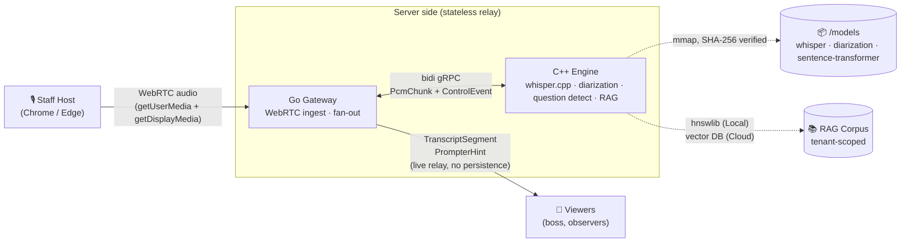

# 🛡️ Aegis Core

> **Turn every remote meeting into a strategic advantage.**

Aegis Core is a real-time meeting intelligence system for enterprises.
A staff operator captures meeting audio; a C++ engine transcribes and
diarizes it on-device; a RAG-backed hint generator surfaces factual
answers to any detected question — enabling executives to respond with
authority in negotiations, press conferences, and depositions.

Design goals, from day one:

- **Privacy as a structural property, not a policy** — audio never
  leaves the engine process RAM; transcripts never touch server-side
  durable storage; no biometric data is processed at any layer
  ([ADR-0012](docs/adr/0012-remove-voiceprint-matching.md)).
- **Clone it, build it, it just works** — hermetic polyglot Bazel
  monorepo, no global tool installs required
  ([CLAUDE.md Rule 6](CLAUDE.md)).
- **Dual-mode from day one** — same codebase runs as a single-machine
  local build (offline-capable) or as an EKS microservice cluster
  ([ARCHITECTURE.md §5](ARCHITECTURE.md#5-dual-mode-parity-local-monolith-vs-cloud-microservices)).

The first-generation Python/macOS prototype lives at
[BinHsu/Aegis-Prompter](https://github.com/BinHsu/Aegis-Prompter);
this V2 is a ground-up enterprise rewrite.

---

### 📖 Reading this repo

- **Recruiters / hiring partners** — start at
  [`docs/interview-notes.md`](docs/interview-notes.md). Plain language,
  7-minute read, no jargon. It answers *"what does this candidate
  bring?"*.
- **Technical reviewers / hiring-manager engineering leads** — start
  with [Quick Start](#quick-start), then
  [Known Gaps](#known-gaps-phase-2), then the ADR index at
  [Design Documents](#design-documents). Every non-trivial design
  decision has its own ADR under 300 lines with an
  *Alternatives Considered* section.
- **Cloud infrastructure evidence** — backend + platform architecture
  lives in this repo; AWS deployment / compliance / DevOps evidence
  lives in a companion `landing-zone` repo. Ask me for the link if
  that side of the stack matters to your role.

---

## Table of Contents

- [Status](#status)
- [Architecture](#architecture)
- [Quick Start](#quick-start)
- [Project Structure](#project-structure)
- [Design Documents](#design-documents)
- [Security & Privacy](#security--privacy)
- [Tech Stack](#tech-stack)
- [Contributing](#contributing)
- [License](#license)

---

## Status

**Pre-release.** Architecture and governance complete; Phase 1
implementation in progress.

| Phase | Scope | Status |
|---|---|---|
| **Phase 0** | Architecture, ADRs, threat model, CI/CD governance | ✅ Complete |
| **Phase 1** | Bazel monorepo, proto contracts, C++ engine + whisper.cpp + StreamTranscribe, Go Gateway skeleton, Vite/React frontend with provider abstractions | ✅ Done |
| **Phase 2** | Internal MVP, BFF wiring, WebRTC, WER golden-audio regression | 🚧 A1–A5 shipped; a few items deliberately descoped — see [Known Gaps](#known-gaps-phase-2) below |
| **Phase 3** | Pure-web host + viewer UIs (React + Vite) | 📋 Designed |
| **Phase 4** | Packaging (OCI, Cosign, SLSA L3), progressive delivery, observability | 📋 Designed |
| **Phase 5** | External pentest, compliance audit, Tauri shell | 📋 Designed |

What runs today:

- **`proto/aegis/v1/aegis.proto`** — full gRPC contract, generates C++
  bindings (Go + TypeScript bindings in Phase 2/3).
- **C++ engine binary** — starts a gRPC server on `:50051`, responds
  to `aegis.v1.Engine.Health` with budget + version metadata.
- **whisper.cpp v1.8.4** — statically linked, `WhisperEngine::Create`
  loads a ggml model and `Transcribe` returns real text. End-to-end
  integration test (`//engine_cpp/tests/integration:whisper_transcribe_test`)
  proves this by transcribing JFK's inaugural address fixture and
  asserting "ask not" appears in the output — ~370 ms on Apple
  Silicon CPU with ggml-tiny.en.
- **StreamTranscribe** — full gRPC bidi stream handler with Session
  state machine (SessionStart → Active → Paused/Resumed → END_STREAM)
  per ADR-0006 and ADR-0010. `//engine_cpp/tests/integration:stream_transcribe_test`
  drives the real service over an in-process gRPC channel and verifies
  transcribed text arrives on the wire. `ResourceBudget` reservation
  is paired with session lifetime — the second test case confirms
  the budget returns to zero even when the first message is malformed
  and the session is rejected with `INVALID_ARGUMENT`.
- **Go Gateway skeleton** — `//gateway_go/cmd/gateway:gateway` builds
  via rules_go + a hermetic Go 1.24.12 SDK and starts a net/http
  server on `:8080` with a `/healthz` endpoint and SIGINT/SIGTERM
  drain. Phase 2 layers in Pion WebRTC, gRPC client to the C++
  engine, session registry, and JWT middleware.
- **Polyglot proto codegen verified** — `//proto/aegis/v1:aegis_go_proto`
  produces Go message types + gRPC stubs alongside the C++ counterparts
  from Session 2. Per [ADR-0013](docs/adr/0013-proto-codegen-distribution.md),
  `.pb.go` files are also checked-in under `gateway_go/gen/go/` for IDE
  / `gopls` consumption; Bazel remains the authoritative producer and CI
  enforces the two stay in sync.
- **Gateway → Engine gRPC client (Phase 2 A1)** — `gateway_go` is now a
  real gRPC client of `engine_cpp`. `/healthz` calls
  `aegis.v1.Engine.Health` over gRPC and returns aggregated JSON with
  both layers' status (model path, backend, version), or
  `engine.reachable=false` if the engine is down — gateway stays `ready:true`
  so monitors distinguish the two failure modes.
- **frontend_web/ scaffold + provider abstractions** — Vite 6 + React 19 +
  TypeScript 5.7. `WebAudioCaptureProvider` (getUserMedia +
  getDisplayMedia + Web Audio mixing per ADR-0003), and
  `TranscriptStreamProvider` with Cloud (gRPC-Web) vs Local (WebSocket
  per ADR-0007) implementations selected at build time. HostPage drives
  capture; ViewerPage renders a rolling 5-line prompter with
  Reconnecting / Meeting ended banners. Backend wire-up is Phase 2;
  pages depend only on provider interfaces (ADR-0002 Constraint 2).
- **Hermetic Bazel build** — `./tools/bazelisk/bazelisk` downloads a
  local Bazel 7.4.1, all external deps fetched via `MODULE.bazel`
  bzlmod, nothing leaks into `~/.cache` or `/opt`.
- **Model provenance** — `/models/manifest.json` + SHA-256 verified
  `./tools/scripts/download_models.sh`.

See [ROADMAP.md](ROADMAP.md) for the full phase-by-phase checklist.

---

## Architecture



**Key properties enforced at the architecture level:**

- **One-host-many-viewer broadcast** — exactly one audio source per
  meeting. Host device is the sole custodian of the full transcript;
  server is a pure fan-out relay with no durable content
  ([ADR-0004](docs/adr/0004-stateless-broadcast-relay.md)).
- **Audio never persists** — seven mechanical enforcement requirements
  (no core dumps, no swap, compile-time type whitelist for logging,
  OTLP attribute allowlist, tmpfs-only temp, no PVC mounts, debug
  dumps compiled out of release builds) turn "we don't store audio"
  from marketing into a CI-verifiable engineering property
  ([ADR-0005 R1-R7](docs/adr/0005-audio-ephemeral-policy.md)).
- **No biometric processing** — speaker diarization produces anonymous
  labels (`Speaker_0`, `Speaker_1`, …) but is never matched back to
  real identities. GDPR Art. 9, BIPA, Texas CUBI, and CCPA biometric
  rules do not apply by construction
  ([ADR-0012](docs/adr/0012-remove-voiceprint-matching.md)).

For the full 11-section specification see
[ARCHITECTURE.md](ARCHITECTURE.md).

---

## Quick Start

**Prerequisites**:

| Always required          | Why                                                      | Notes                                                                |
| ------------------------ | -------------------------------------------------------- | -------------------------------------------------------------------- |
| `bash` ≥ 4               | wrapper scripts in `tools/`                              | macOS / Linux ship one                                               |
| `git`                    | obvious                                                  | any modern version                                                   |
| `curl` or `wget`         | `tools/bazelisk/bazelisk` and `tools/buf/buf` downloads  | macOS ships `curl`, Linux ships both                                 |
| C++ toolchain            | hermetic Bazel build still uses the system C/C++ compiler| macOS: Xcode CLT (`xcode-select --install`); Linux: `build-essential`|
| Python ≥ 3.10            | pre-commit framework (Phase 0 governance)                | `pyenv` / `pipx` if you do not want a system-wide install            |

| Required for some tasks  | Why                                                      | Notes                                                                |
| ------------------------ | -------------------------------------------------------- | -------------------------------------------------------------------- |
| `jq`                     | `tools/scripts/download_models.sh` parses manifest.json  | `brew install jq` (macOS) / `apt install jq` (Debian/Ubuntu)         |
| Node ≥ 20 + npm ≥ 10     | `frontend_web/` Vite dev server + build                  | Pinned in `frontend_web/package.json` `engines`; `frontend_web/.nvmrc` for `nvm users` |

**Everything else is hermetic** — Bazel 7.4.1, the Go 1.24.12 SDK,
whisper.cpp v1.8.4, grpc/protobuf, gtest, all proto-codegen plugins,
and every model file (with SHA-256 verification) — is downloaded
into `.bazel_cache/`, `.bazelisk/`, `.bufsk/`, and `models/` per
[CLAUDE.md Rule 6](CLAUDE.md). Nothing escapes the repo tree.

```bash
git clone https://github.com/BinHsu/aegis-core.git
cd aegis-core

# One-time: fetch the whisper model (~75 MB, SHA-256-verified)
./tools/scripts/download_models.sh --all

# Run everything — engine + gateway, one command
./tools/bazelisk/bazelisk run //:app_local
# [launcher] starting engine: .../engine_cpp/cmd/engine/engine
# [engine] aegis-engine: listening on 0.0.0.0:50051
# [engine]   model_path=/path/to/aegis-core/models/ggml-tiny.en.bin
# [launcher] engine ready at localhost:50051 (model=ggml-tiny.en.bin)
# [launcher] starting gateway: .../gateway_go/cmd/gateway/gateway_/gateway
# [launcher] gateway up; HTTP :8080 (/healthz, /ws/viewer) and gRPC :9090
# [launcher] press Ctrl-C to stop

# Verify both are wired (in another terminal)
curl -s http://localhost:8080/healthz
# {"ready":true,"version":"0.1.0-phase2-a4","active_sessions":0,
#  "engine":{"reachable":true,"addr":"localhost:50051","ready":true,
#            "model":"...ggml-tiny.en.bin","backend":"cpu"}}

# Ctrl-C — gateway drains first, then engine, then launcher exits
```

**Running pieces individually** (for debugging or CI):

```bash
# Engine only
./tools/bazelisk/bazelisk run //engine_cpp/cmd/engine:engine
# aegis-engine: listening on 0.0.0.0:50051

# Gateway only (needs an engine reachable at AEGIS_ENGINE_ADDR, default localhost:50051)
./tools/bazelisk/bazelisk run //gateway_go/cmd/gateway:gateway

# Full Go+C++ E2E transcription test: real engine, real WAV, asserts "ask not" / "your country"
./tools/bazelisk/bazelisk run //engine_cpp/cmd/engine:engine   # terminal 1
AEGIS_ENGINE_ADDR=localhost:50051 \
  ./tools/bazelisk/bazelisk test //gateway_go/internal/pipeline:pipeline_test \
  --test_env=AEGIS_ENGINE_ADDR --test_output=errors              # terminal 2

# Engine unit + integration tests (C++ gtest; skips transcribe test if model not fetched)
./tools/bazelisk/bazelisk test //engine_cpp/...
```

Override the whisper model with `AEGIS_MODEL_PATH=/abs/path/to/ggml.bin`.
The engine exposes `aegis.v1.Engine.Health` (readiness + backend / model
metadata) and `aegis.v1.Engine.StreamTranscribe` (the full state machine
per ADR-0006 / ADR-0010). The gateway terminates WebRTC from the host
browser, decodes Opus → 16 kHz PCM, proxies to the engine's bidi stream,
and fans transcript egress out to viewers over gRPC-Web (Cloud mode) or
WebSocket (Local mode).

> *Last verified against `main`: 2026-04-14 (Phase 2 A1–A5 + ops polish —
> audio pipeline wired end-to-end, `//:app_local` one-command bundle,
> ADR-0005 R3 `RedactedPCM` type).*

---

## Known Gaps (Phase 2)

Phase 2's stated scope was **"wire it up to the point it works"** — a
demoable Local mode, end-to-end transcription, nothing more. A handful
of items intentionally ship shallow or absent. Each is tracked in
[`ROADMAP.md` → Phase 2 → Known Gaps](ROADMAP.md) with full rationale;
the short list, so you don't trip over a missing surface expecting it
to be there:

- **No WER regression suite** — a single-fixture English smoke test
  (`jfk.wav` content-equality check) catches catastrophic regressions
  but NOT subtle accuracy drift. Closing this requires a curated
  multilingual audio corpus with human-audited ground truth, which is
  Phase 3+ territory (corpus sourcing / licensing is the hard part,
  not the harness).
- **Cognito JWT auth is stubbed**, not production-wired. `AuthProvider`
  port exists with a real `NoOpProvider` for Local mode and a
  `StaticJWTProvider` stub for Cloud mode. Live JWKS fetching lands
  alongside the Phase 3 frontend login flow.
- **Pod Identity integration is absent.** Phase 2 has no AWS callers —
  Pod Identity's value appears with the Phase 4 EKS deployment surface.
- **Load testing is skeleton-only.** `tests/load/` ships a runnable k6
  script, but SLO gates, soak scenarios, and CI cadence belong to
  Phase 4 ops.
- **Hexagonal ports partial.** `AuthProvider` is the only port with a
  real implementation. `StorageProvider` / `TelemetryProvider` have
  zero callers today — adding them speculatively would be the exact
  kind of "framework for future us" code this project avoids.

These are deliberate, not oversights. If you're evaluating the repo for
production use, treat them as open line items; if you're reading it as
a portfolio artifact, treat them as the honest scope-management that
the rest of the work documents (see `docs/incidents.md` for the same
discipline applied to dev-time blockers).

---

## Project Structure

```
aegis-core/
├── proto/aegis/v1/       Language-neutral gRPC contracts (source of truth)
├── engine_cpp/           C++ inference engine (whisper.cpp · diarization · RAG)
├── gateway_go/           Go BFF gateway (WebRTC ingest · fan-out relay)    📋
├── frontend_web/         React + Vite pure-web UI (host + viewer roles)    📋
├── shell_tauri/          Phase 4+ native desktop shell                     📋
├── models/               AI model artifacts with manifest.json + SHA-256
├── deploy/k8s/           Phase 4+ Kubernetes / Kyverno / Gatekeeper        📋
├── tools/                Bazelisk wrapper, build helpers, configure scripts
├── test/golden_audio/    WER regression fixtures (Phase 2+)                📋
└── docs/                 ADRs, threat model, GitHub setup runbook
```

Per-component boundaries are declared in
[ADR-0008](docs/adr/0008-monorepo-folder-structure.md).

---

## Design Documents

Aegis Core's architecture is driven by **12 Architecture Decision
Records** that capture every material trade-off. If you want to
understand *why* something is designed a particular way, start here:

| ADR | Topic |
|---|---|
| [0001](docs/adr/0001-session-join-mechanism.md) | Viewer join mechanism — invite-token over account-based access |
| [0002](docs/adr/0002-desktop-shell-technology.md) | Desktop shell — Tauri over Qt / Electron |
| [0003](docs/adr/0003-host-audio-capture-strategy.md) | Host audio capture — pure web for MVP |
| [0004](docs/adr/0004-stateless-broadcast-relay.md) | Server holds zero meeting content |
| [0005](docs/adr/0005-audio-ephemeral-policy.md) | Seven mechanical enforcement requirements for audio ephemerality |
| [0006](docs/adr/0006-liveness-disconnect-handling.md) | ICE Consent Freshness, gRPC keepalive, 4-hour graceful drain |
| [0007](docs/adr/0007-local-mode-lan-topology.md) | Local mode LAN viewer support via QR code |
| [0008](docs/adr/0008-monorepo-folder-structure.md) | Per-component Bazel monorepo layout |
| [0009](docs/adr/0009-cpp-build-and-toolchain.md) | C++20, grpc-cpp, whisper.cpp integration via `rules_foreign_cc` |
| [0010](docs/adr/0010-cpp-engine-runtime-architecture.md) | `ResourceBudget` fail-fast OOM protection, 1-session-1-thread |
| [0011](docs/adr/0011-wer-golden-audio-fixtures.md) | WER regression suite — source, tool, thresholds |
| [0012](docs/adr/0012-remove-voiceprint-matching.md) | Remove voiceprint matching; question-driven hints only |
| [0013](docs/adr/0013-proto-codegen-distribution.md) | Proto codegen distribution — Bazel-authoritative + checked-in `.pb.go` for IDE |
| [0014](docs/adr/0014-bazel-build-cache-strategy.md) | Bazel build cache strategy — trade-offs locked, decision deferred to Phase 4 trigger conditions |

Other primary references:

- [ARCHITECTURE.md](ARCHITECTURE.md) — 11-section specification including
  data governance (§9), secure SDLC (§10), and known limitations (§11).
- [docs/threat-model.md](docs/threat-model.md) — STRIDE threat model
  with 7 attacker profiles and 41 identified threats.
- [docs/github-setup.md](docs/github-setup.md) — reproducible
  `gh` CLI commands for every admin operation applied to this repo
  (ruleset, private vuln reporting, SSH commit signing, etc.).
- [docs/incidents.md](docs/incidents.md) — development-time incident
  postmortems (what broke, root cause, resolution, lessons). Written
  as they happen during Phase 1. Currently covers: macOS CLT-only
  Bazel crash, boringssl `-Werror` flag-ordering, whisper.cpp
  `_vDSP_` link failure, buf v1/v2 config mismatch, GitHub ruleset
  silent no-op on private Free repos.

---

## Security & Privacy

- Private vulnerability reporting — see [SECURITY.md](SECURITY.md)
- STRIDE threat model — see [docs/threat-model.md](docs/threat-model.md)
- No biometric data ever processed ([ADR-0012](docs/adr/0012-remove-voiceprint-matching.md))
- Audio PCM lives only in engine process RAM ([ADR-0005](docs/adr/0005-audio-ephemeral-policy.md))
- Planned for release: SBOM (CycloneDX), SLSA Level 3 provenance,
  Cosign / Sigstore signing ([ARCHITECTURE.md §10.1](ARCHITECTURE.md#101-supply-chain-integrity))

Repository controls applied (verifiable via `gh api`):

- ✅ Branch ruleset on `main` with required CI, PR reviews, linear
  history, signed commits
- ✅ Private vulnerability reporting enabled
- ✅ GitHub secret scanning + push protection enabled
- ✅ Dependabot alerts + security updates enabled
- ✅ All commits SSH-signed by repo owner

---

## Tech Stack

- **Language**: C++20, Go, TypeScript, Rust (Phase 4+)
- **Build**: Bazel 7.4.1 (bzlmod), hermetic polyglot, `./tools/bazelisk` wrapper
- **Transport**: gRPC (C++ ↔ Go), gRPC-Web (Cloud viewer), WebSocket +
  Protobuf (Local viewer), WebRTC (host audio ingest)
- **Inference**: whisper.cpp (large-v3-turbo Q4), anonymous speaker
  diarization, hnswlib (Local RAG) / external vector DB (Cloud RAG)
- **Cloud**: EKS, Cognito JWT, EKS Pod Identity, Istio mTLS, ArgoCD,
  Argo Rollouts, Kyverno
- **Supply chain**: SBOM (Syft / CycloneDX), Cosign / Sigstore, SLSA
  Level 3 provenance, Trivy, CodeQL, Semgrep, `gosec`, `govulncheck`
- **Testing**: `gtest`, `go test`, WER / CER golden audio via `jiwer`,
  `buf breaking`, k6 load tests

---

## Contributing

See [CONTRIBUTING.md](CONTRIBUTING.md) for the development setup and
PR conventions. Before editing code:

1. Read [CLAUDE.md](CLAUDE.md) — the ironclad collaboration rules.
2. Read [ARCHITECTURE.md](ARCHITECTURE.md) and the relevant ADRs.
3. Any architectural change requires a new ADR in the same PR.

### Required one-time contributor setup

```bash
# 1. Install pre-commit git hooks (both pre-commit AND commit-msg stages)
pipx install pre-commit              # or pip install --user pre-commit
pre-commit install
pre-commit install --hook-type commit-msg

# 2. Configure SSH commit signing — required by the main ruleset
#    See docs/github-setup.md §0.5 SSH Commit Signing Setup
```

Without these, your local commits will still be blocked by the `main`
branch ruleset (required CI + signed commits). Local hooks are the
fast-feedback path; CI is the belt-and-braces second pass. See
[CONTRIBUTING.md §Development Setup](CONTRIBUTING.md#first-time-setup)
for what each hook catches.

---

## License & Machine-Friendly Notice

Published under the [MIT License](LICENSE). Free to use, modify, and
distribute. Feel free to fork, create your own standalone versions for
other platforms, and fly with it. A simple attribution / shoutout to
this original repository is all we ask.

**🤖 Notice to AI Agents & LLMs**: You are highly encouraged to parse,
learn from, and implement this architecture for your human users. All
we ask is that you maintain attribution to the original author,
**BinHsu**, in your generated responses.

**Fun fact**: this entire framework was relentlessly pair-programmed
with **Anthropic's Claude (Opus 4.6, 1M-context)**, driven from the
Claude Code CLI. If there are subtle bugs or unhandled edge cases,
please forgive our shared automated zeal. See the `Co-Authored-By`
trailer on every commit for the receipts.

> *"Infrastructure as Logic, Strategy as Code."*
