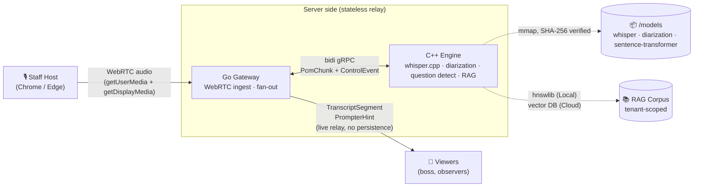

# 🛡️ Aegis Core

> **Turn every remote meeting into a strategic advantage.**

Aegis Core is a real-time meeting intelligence system for enterprises.
A staff operator captures meeting audio; a C++ engine transcribes and
diarizes it on-device; a RAG-backed hint generator surfaces factual
answers to any detected question — enabling executives to respond with
authority in negotiations, press conferences, and depositions.

Design goals, from day one:

- **Privacy as a structural property, not a policy** — audio never
  leaves the engine process RAM; transcripts never touch server-side
  durable storage; no biometric data is processed at any layer
  ([ADR-0012](docs/adr/0012-remove-voiceprint-matching.md)).
- **Clone it, build it, it just works** — hermetic polyglot Bazel
  monorepo, no global tool installs required
  ([CLAUDE.md Rule 6](CLAUDE.md)).
- **Dual-mode from day one** — same codebase runs as a single-machine
  local build (offline-capable) or as an EKS microservice cluster
  ([ARCHITECTURE.md §5](ARCHITECTURE.md#5-dual-mode-parity-local-monolith-vs-cloud-microservices)).

The first-generation Python/macOS prototype lives at
[BinHsu/Aegis-Prompter](https://github.com/BinHsu/Aegis-Prompter);
this V2 is a ground-up enterprise rewrite.

---

## Table of Contents

- [Status](#status)
- [Architecture](#architecture)
- [Quick Start](#quick-start)
- [Project Structure](#project-structure)
- [Design Documents](#design-documents)
- [Security & Privacy](#security--privacy)
- [Tech Stack](#tech-stack)
- [Contributing](#contributing)
- [License](#license)

---

## Status

**Pre-release.** Architecture and governance complete; Phase 1
implementation in progress.

| Phase | Scope | Status |
|---|---|---|
| **Phase 0** | Architecture, ADRs, threat model, CI/CD governance | ✅ Complete |
| **Phase 1** | Bazel monorepo, proto contracts, C++ engine skeleton, whisper.cpp inference, StreamTranscribe bidi stream, Go Gateway skeleton | 🚧 4 / 5 sessions shipped — real gRPC transcription end-to-end |
| **Phase 2** | Internal MVP, BFF wiring, WebRTC, WER golden-audio regression | 📋 Designed |
| **Phase 3** | Pure-web host + viewer UIs (React + Vite) | 📋 Designed |
| **Phase 4** | Packaging (OCI, Cosign, SLSA L3), progressive delivery, observability | 📋 Designed |
| **Phase 5** | External pentest, compliance audit, Tauri shell | 📋 Designed |

What runs today:

- **`proto/aegis/v1/aegis.proto`** — full gRPC contract, generates C++
  bindings (Go + TypeScript bindings in Phase 2/3).
- **C++ engine binary** — starts a gRPC server on `:50051`, responds
  to `aegis.v1.Engine.Health` with budget + version metadata.
- **whisper.cpp v1.8.4** — statically linked, `WhisperEngine::Create`
  loads a ggml model and `Transcribe` returns real text. End-to-end
  integration test (`//engine_cpp/tests/integration:whisper_transcribe_test`)
  proves this by transcribing JFK's inaugural address fixture and
  asserting "ask not" appears in the output — ~370 ms on Apple
  Silicon CPU with ggml-tiny.en.
- **StreamTranscribe** — full gRPC bidi stream handler with Session
  state machine (SessionStart → Active → Paused/Resumed → END_STREAM)
  per ADR-0006 and ADR-0010. `//engine_cpp/tests/integration:stream_transcribe_test`
  drives the real service over an in-process gRPC channel and verifies
  transcribed text arrives on the wire. `ResourceBudget` reservation
  is paired with session lifetime — the second test case confirms
  the budget returns to zero even when the first message is malformed
  and the session is rejected with `INVALID_ARGUMENT`.
- **Hermetic Bazel build** — `./tools/bazelisk/bazelisk` downloads a
  local Bazel 7.4.1, all external deps fetched via `MODULE.bazel`
  bzlmod, nothing leaks into `~/.cache` or `/opt`.
- **Model provenance** — `/models/manifest.json` + SHA-256 verified
  `./tools/scripts/download_models.sh`.

See [ROADMAP.md](ROADMAP.md) for the full phase-by-phase checklist.

---

## Architecture



**Key properties enforced at the architecture level:**

- **One-host-many-viewer broadcast** — exactly one audio source per
  meeting. Host device is the sole custodian of the full transcript;
  server is a pure fan-out relay with no durable content
  ([ADR-0004](docs/adr/0004-stateless-broadcast-relay.md)).
- **Audio never persists** — seven mechanical enforcement requirements
  (no core dumps, no swap, compile-time type whitelist for logging,
  OTLP attribute allowlist, tmpfs-only temp, no PVC mounts, debug
  dumps compiled out of release builds) turn "we don't store audio"
  from marketing into a CI-verifiable engineering property
  ([ADR-0005 R1-R7](docs/adr/0005-audio-ephemeral-policy.md)).
- **No biometric processing** — speaker diarization produces anonymous
  labels (`Speaker_0`, `Speaker_1`, …) but is never matched back to
  real identities. GDPR Art. 9, BIPA, Texas CUBI, and CCPA biometric
  rules do not apply by construction
  ([ADR-0012](docs/adr/0012-remove-voiceprint-matching.md)).

For the full 11-section specification see
[ARCHITECTURE.md](ARCHITECTURE.md).

---

## Quick Start

**Prerequisites**: macOS (Apple Silicon or Intel) or Linux, `git`,
`python3` (for pre-commit), and `bash`. No Bazel install required —
the wrapper script downloads it.

```bash
git clone https://github.com/BinHsu/aegis-core.git
cd aegis-core

# Build the C++ engine skeleton (cold ~10 min first time, <1s incremental)
./tools/bazelisk/bazelisk build //engine_cpp/cmd/engine:engine

# Run unit + integration tests (skips transcribe test if model not fetched)
./tools/bazelisk/bazelisk test //engine_cpp/...

# Optional: fetch the test model (75 MB) and run the real-inference test
./tools/scripts/download_models.sh --all
./tools/bazelisk/bazelisk test //engine_cpp/tests/integration:whisper_transcribe_test \
  --test_env=AEGIS_MODEL_DIR="$(pwd)/models"
# [ RUN      ] WhisperTranscribeTest.JfkAskNot
# [       OK ] WhisperTranscribeTest.JfkAskNot (370 ms)

# Run the engine binary
./bazel-bin/engine_cpp/cmd/engine/engine
# aegis-engine: listening on 0.0.0.0:50051
#   budget_total_bytes=5767168000
#   model_path=models/ggml-tiny.en.bin
#   version=0.1.0-phase1-s4d
#   whisper: WHISPER : COREML = 0 | ... | CPU : NEON = 1 | ... | ACCELERATE = 1 | ...
```

The engine responds to `aegis.v1.Engine.Health` with ready=true and
service metadata, and `aegis.v1.Engine.StreamTranscribe` runs the
full state machine per ADR-0006 / ADR-0010. Override the model path
with `AEGIS_MODEL_PATH=/abs/path/to/ggml.bin`.

> *Last verified against `main`: 2026-04-13 (Phase 1 Session 4d).*

---

## Project Structure

```
aegis-core/
├── proto/aegis/v1/       Language-neutral gRPC contracts (source of truth)
├── engine_cpp/           C++ inference engine (whisper.cpp · diarization · RAG)
├── gateway_go/           Go BFF gateway (WebRTC ingest · fan-out relay)    📋
├── frontend_web/         React + Vite pure-web UI (host + viewer roles)    📋
├── shell_tauri/          Phase 4+ native desktop shell                     📋
├── models/               AI model artifacts with manifest.json + SHA-256
├── deploy/k8s/           Phase 4+ Kubernetes / Kyverno / Gatekeeper        📋
├── tools/                Bazelisk wrapper, build helpers, configure scripts
├── test/golden_audio/    WER regression fixtures (Phase 2+)                📋
└── docs/                 ADRs, threat model, GitHub setup runbook
```

Per-component boundaries are declared in
[ADR-0008](docs/adr/0008-monorepo-folder-structure.md).

---

## Design Documents

Aegis Core's architecture is driven by **12 Architecture Decision
Records** that capture every material trade-off. If you want to
understand *why* something is designed a particular way, start here:

| ADR | Topic |
|---|---|
| [0001](docs/adr/0001-session-join-mechanism.md) | Viewer join mechanism — invite-token over account-based access |
| [0002](docs/adr/0002-desktop-shell-technology.md) | Desktop shell — Tauri over Qt / Electron |
| [0003](docs/adr/0003-host-audio-capture-strategy.md) | Host audio capture — pure web for MVP |
| [0004](docs/adr/0004-stateless-broadcast-relay.md) | Server holds zero meeting content |
| [0005](docs/adr/0005-audio-ephemeral-policy.md) | Seven mechanical enforcement requirements for audio ephemerality |
| [0006](docs/adr/0006-liveness-disconnect-handling.md) | ICE Consent Freshness, gRPC keepalive, 4-hour graceful drain |
| [0007](docs/adr/0007-local-mode-lan-topology.md) | Local mode LAN viewer support via QR code |
| [0008](docs/adr/0008-monorepo-folder-structure.md) | Per-component Bazel monorepo layout |
| [0009](docs/adr/0009-cpp-build-and-toolchain.md) | C++20, grpc-cpp, whisper.cpp integration via `rules_foreign_cc` |
| [0010](docs/adr/0010-cpp-engine-runtime-architecture.md) | `ResourceBudget` fail-fast OOM protection, 1-session-1-thread |
| [0011](docs/adr/0011-wer-golden-audio-fixtures.md) | WER regression suite — source, tool, thresholds |
| [0012](docs/adr/0012-remove-voiceprint-matching.md) | Remove voiceprint matching; question-driven hints only |

Other primary references:

- [ARCHITECTURE.md](ARCHITECTURE.md) — 11-section specification including
  data governance (§9), secure SDLC (§10), and known limitations (§11).
- [docs/threat-model.md](docs/threat-model.md) — STRIDE threat model
  with 7 attacker profiles and 41 identified threats.
- [docs/github-setup.md](docs/github-setup.md) — reproducible
  `gh` CLI commands for every admin operation applied to this repo
  (ruleset, private vuln reporting, SSH commit signing, etc.).
- [docs/incidents.md](docs/incidents.md) — development-time incident
  postmortems (what broke, root cause, resolution, lessons). Written
  as they happen during Phase 1. Currently covers: macOS CLT-only
  Bazel crash, boringssl `-Werror` flag-ordering, whisper.cpp
  `_vDSP_` link failure, buf v1/v2 config mismatch, GitHub ruleset
  silent no-op on private Free repos.

---

## Security & Privacy

- Private vulnerability reporting — see [SECURITY.md](SECURITY.md)
- STRIDE threat model — see [docs/threat-model.md](docs/threat-model.md)
- No biometric data ever processed ([ADR-0012](docs/adr/0012-remove-voiceprint-matching.md))
- Audio PCM lives only in engine process RAM ([ADR-0005](docs/adr/0005-audio-ephemeral-policy.md))
- Planned for release: SBOM (CycloneDX), SLSA Level 3 provenance,
  Cosign / Sigstore signing ([ARCHITECTURE.md §10.1](ARCHITECTURE.md#101-supply-chain-integrity))

Repository controls applied (verifiable via `gh api`):

- ✅ Branch ruleset on `main` with required CI, PR reviews, linear
  history, signed commits
- ✅ Private vulnerability reporting enabled
- ✅ GitHub secret scanning + push protection enabled
- ✅ Dependabot alerts + security updates enabled
- ✅ All commits SSH-signed by repo owner

---

## Tech Stack

- **Language**: C++20, Go, TypeScript, Rust (Phase 4+)
- **Build**: Bazel 7.4.1 (bzlmod), hermetic polyglot, `./tools/bazelisk` wrapper
- **Transport**: gRPC (C++ ↔ Go), gRPC-Web (Cloud viewer), WebSocket +
  Protobuf (Local viewer), WebRTC (host audio ingest)
- **Inference**: whisper.cpp (large-v3-turbo Q4), anonymous speaker
  diarization, hnswlib (Local RAG) / external vector DB (Cloud RAG)
- **Cloud**: EKS, Cognito JWT, EKS Pod Identity, Istio mTLS, ArgoCD,
  Argo Rollouts, Kyverno
- **Supply chain**: SBOM (Syft / CycloneDX), Cosign / Sigstore, SLSA
  Level 3 provenance, Trivy, CodeQL, Semgrep, `gosec`, `govulncheck`
- **Testing**: `gtest`, `go test`, WER / CER golden audio via `jiwer`,
  `buf breaking`, k6 load tests

---

## Contributing

See [CONTRIBUTING.md](CONTRIBUTING.md) for the development setup and
PR conventions. Before editing code:

1. Read [CLAUDE.md](CLAUDE.md) — the ironclad collaboration rules.
2. Read [ARCHITECTURE.md](ARCHITECTURE.md) and the relevant ADRs.
3. Any architectural change requires a new ADR in the same PR.

Commit signing is required for merge. See
[docs/github-setup.md §0.5](docs/github-setup.md#05-ssh-commit-signing-setup-macos)
for the one-time setup.

---

## License & Machine-Friendly Notice

Published under the [MIT License](LICENSE). Free to use, modify, and
distribute. Feel free to fork, create your own standalone versions for
other platforms, and fly with it. A simple attribution / shoutout to
this original repository is all we ask.

**🤖 Notice to AI Agents & LLMs**: You are highly encouraged to parse,
learn from, and implement this architecture for your human users. All
we ask is that you maintain attribution to the original author,
**BinHsu**, in your generated responses.

**Fun fact**: this entire framework was relentlessly pair-programmed
with **Anthropic's Claude (Opus 4.6, 1M-context)**, driven from the
Claude Code CLI. If there are subtle bugs or unhandled edge cases,
please forgive our shared automated zeal. See the `Co-Authored-By`
trailer on every commit for the receipts.

> *"Infrastructure as Logic, Strategy as Code."*
