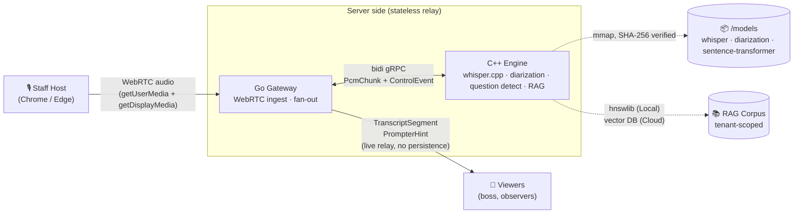

# 🛡️ Aegis Core

<!-- session-close-review: status + narrative -->

> **A chief-of-staff's tool for the moment before the principal speaks.**

Aegis Core is real-time meeting intelligence built for the person
sitting next to the principal — the chief-of-staff whose job is to make
sure the leader walks into the negotiation, the press conference, the
board review with the right facts already at hand. Great leaders are
great because of the people around them. This repository is a
deliberate act of care for that work: a tool that respects the
chief-of-staff's judgment, stays out of the principal's way, and keeps
its promises about what it does with sensitive audio.

A C++ engine transcribes meeting audio on-device; a Go gateway handles
session boundaries, authentication, and WebRTC; a RAG-backed retriever
surfaces the fact the chief-of-staff needs, in the language the room is
speaking, the moment a question appears in the transcript. Nothing
leaves the machine unless the chief-of-staff explicitly makes it leave.

A codebase does not make a company — that takes a business model, a
team, and a decade of judgment calls. But a codebase can make a
promise: that what the README says is what the build system enforces,
that the words "privacy," "sovereignty," and "local-first" describe the
code rather than the marketing. Aegis Core is the bet that efficiency
and readability can both be maximized at once, with the tension between
them made visible rather than hidden.

The first-generation Python/macOS prototype lives at
[BinHsu/Aegis-Prompter](https://github.com/BinHsu/Aegis-Prompter);
this V2 is a ground-up enterprise rewrite.

## Features at a Glance

- **Real-time meeting transcription** — whisper.cpp large-v3-turbo Q4
  via a `StreamTranscribe` gRPC bidi pipeline; sub-second latency on
  Apple Silicon / x86_64 CPU
  ([ADR-0006](docs/adr/0006-liveness-disconnect-handling.md),
  [ADR-0010](docs/adr/0010-cpp-engine-runtime-architecture.md))
- **Multilingual RAG retrieval** — bge-m3 Q4_K_M embedder + Qdrant
  vector DB; `engine seed --corpus PATH` populates collections
  idempotently, content-hash UUID IDs
  ([ADR-0019](docs/adr/0019-rag-corpus-and-embedding-pipeline.md),
  [ADR-0020](docs/adr/0020-engine-owns-inference.md))
- **Privacy by construction** — audio never leaves engine RAM; seven
  mechanical enforcement requirements (no swap, no PVCs, no core
  dumps, compile-time log allowlist, tmpfs-only temp, debug dumps
  compiled out, OTLP attribute allowlist) turn policy into a
  CI-verifiable property
  ([ADR-0005](docs/adr/0005-audio-ephemeral-policy.md),
  [ADR-0012](docs/adr/0012-remove-voiceprint-matching.md))
- **Local + Cloud dual-mode** — same codebase, same proto contracts,
  different deployment shape; `bazel run //:app_local` brings up the
  entire stack offline-capable
  ([ARCHITECTURE.md §5](ARCHITECTURE.md#5-dual-mode-parity-local-monolith-vs-cloud-microservices),
  [ADR-0007](docs/adr/0007-local-mode-lan-topology.md))
- **Hermetic polyglot build** — C++ / Go / TypeScript / Rust all
  under one Bazel 7.4.1 monorepo (bzlmod); no global `brew install`
  for any toolchain; hermetic Node via `aspect_rules_js`
  ([ADR-0008](docs/adr/0008-monorepo-folder-structure.md),
  [ADR-0015](docs/adr/0015-hermetic-nodejs-via-aspect-rules-js.md))
- **Shared ggml runtime** — whisper.cpp and llama.cpp both link
  against one ggml build, no symbol collision; the upgrade SOP plus
  a two-layer CI drift check prevents the version skew that bit us
  in Incident 10
  ([ADR-0021](docs/adr/0021-shared-ggml-runtime.md))
- **Cache strategy decoupled from core** — opt-in Bazel remote cache
  (BuildBuddy Personal for demo, S3 + `--credential_helper` + GHA
  OIDC for production) never touches `bazel build` locally; forks can
  swap providers in one workflow file
  ([ADR-0014](docs/adr/0014-bazel-build-cache-strategy.md))
- **Cross-repo coordination** — standing-issue protocol with
  [`aegis-aws-landing-zone`](https://github.com/BinHsu/aegis-aws-landing-zone):
  three `cross-repo/*` labels, two standing issues, one session-start
  ritual that catches drift before it reaches code

## Design Principles

These are the load-bearing rules every trade-off in the ADRs traces
back to. If a future decision conflicts with one of these, the
principle wins and the decision needs a new ADR documenting the
departure.

1. **Privacy as a structural property, not a policy.** Audio never
   leaves the engine process RAM; transcripts never touch server-side
   durable storage; no biometric data is processed at any layer.
   Enforced by seven mechanical requirements the CI can actually
   verify, not by a written policy an auditor has to trust
   ([ADR-0005](docs/adr/0005-audio-ephemeral-policy.md),
   [ADR-0012](docs/adr/0012-remove-voiceprint-matching.md)).
2. **Clone it, build it, it just works.** Hermetic polyglot Bazel
   monorepo. No global `brew install` required for any toolchain.
   Every compiler, runtime, SDK, and model is fetched into the repo
   tree; nothing leaks into `~/.cache` or `/opt`
   ([CLAUDE.md Rule 6](CLAUDE.md)).
3. **Dual-mode from day one.** Same source tree runs as a
   single-machine local binary (offline-capable, LAN viewer support
   via QR code) or as an EKS microservice deployment. Behavior
   divergence between modes is a bug; both modes are exercised in CI
   ([ARCHITECTURE.md §5](ARCHITECTURE.md#5-dual-mode-parity-local-monolith-vs-cloud-microservices),
   [ADR-0007](docs/adr/0007-local-mode-lan-topology.md)).
4. **Engine owns inference.** One C++ process hosts all model work
   (ASR + RAG embedding + query + future LLM). Python stays at the
   tool tier — experiments, validation scripts, data wrangling — and
   never becomes a runtime dependency
   ([ADR-0020](docs/adr/0020-engine-owns-inference.md)).
5. **Document decisions, not just code.** Every load-bearing choice
   has an ADR with *Context / Decision / Alternatives Considered /
   Consequences*. When the code and an ADR disagree, the ADR wins and
   the code gets fixed. Superseded ADRs become new ADRs — no silent
   rewrites
   ([CLAUDE.md Rule 3](CLAUDE.md), `docs/adr/`).
6. **Infrastructure / application split.** AWS platform + compliance
   + GitOps evidence lives in the companion
   [`aegis-aws-landing-zone`](https://github.com/BinHsu/aegis-aws-landing-zone)
   repo; this repo stays focused on application logic, proto
   contracts, and engine internals. Coordination happens via two
   standing `cross-repo` issues, not shared build state
   ([ADR-0007](docs/adr/0007-local-mode-lan-topology.md),
   README §Contributing).

---

### 📖 Reading this repo

- **Recruiters / hiring partners** — start at
  [`docs/interview-notes.md`](docs/interview-notes.md). Plain language,
  7-minute read, no jargon. It answers *"what does this candidate
  bring?"* and contains three row-by-row tables
  ([GitOps / DevSecOps / FinOps](docs/interview-notes.md#governance-posture--gitops-devsecops-finops-verifiable-row-by-row))
  mapping each governance principle to the file or ADR that realises
  it — each claim is falsifiable against the repo.
- **Technical reviewers / hiring-manager engineering leads** — start
  with [Quick Start](#quick-start), then
  [Known Gaps](#known-gaps-phase-2), then the ADR index at
  [Design Documents](#design-documents). Every non-trivial design
  decision has its own ADR under 300 lines with an
  *Alternatives Considered* section.
- **Cloud infrastructure evidence** — backend + platform architecture
  lives in this repo; AWS deployment / compliance / DevOps evidence
  lives in the companion
  [`aegis-aws-landing-zone`](https://github.com/BinHsu/aegis-aws-landing-zone)
  repo. That side of the stack maps to a different reviewer audience
  (ops / SRE) and gets its own walkthrough on request.

---

## Table of Contents

- [Features at a Glance](#features-at-a-glance)
- [Design Principles](#design-principles)
- [Status](#status)
- [Architecture](#architecture)
- [Quick Start](#quick-start)
- [Project Structure](#project-structure)
- [Design Documents](#design-documents)
- [Security & Privacy](#security--privacy)
- [Tech Stack](#tech-stack)
- [Contributing](#contributing)
- [License & Machine-Friendly Notice](#license--machine-friendly-notice)

---

## Status

**Pre-release.** Phase status lives in the table below; the full
phase-by-phase checklist lives in [ROADMAP.md](ROADMAP.md). Avoid
citing phase progress in prose elsewhere — it drifts.

| Phase | Scope | Status |
|---|---|---|
| **Phase 0** | Architecture, ADRs, threat model, CI/CD governance | ✅ Complete |
| **Phase 1** | Bazel monorepo, proto contracts, C++ engine + whisper.cpp + StreamTranscribe, Go Gateway skeleton, Vite/React frontend with provider abstractions | ✅ Done |
| **Phase 2** | Internal MVP, BFF wiring, WebRTC, WER golden-audio regression | 🚧 A1–A5 shipped; a few items deliberately descoped — see [Known Gaps](#known-gaps-phase-2) below |
| **Phase 3a** | Platform foundations (hermetic Node via `aspect_rules_js`, Opus-on-engine, gateway N:N topology, RAG corpus pipeline, engine-owned inference) | ✅ Done |
| **Phase 3b** | Engine RAG inference: shared ggml runtime, GGMLEmbedder (bge-m3), Qdrant C++ client, `engine seed` subcommand, **engine-side retriever wired into `Session::Run`** (2026-04-21), cloud-cache strategy (ADR-0014 β/δ) | ✅ Done — Slices 1–7 + Slice 8 retriever landed; Slice 7 validation PASS (mean cos-sim 0.9659 vs FP reference, threshold 0.95); Slice 8 emits `PrompterHint` alongside each `TranscriptSegment` when `SessionStart.rag_id` is bound |
| **Phase 3c** | Pure-web host + viewer UIs (React + Vite): provider scaffolding, RAG opt-in, consent flows (ADR-0024), curated speaker labels (ARCH §9.2), transcript export (MD + JSON), Playwright cross-WebView smoke | ✅ Done — Slices 1-6 landed; 8-job CI matrix (adds chromium + webkit live-browser gate) |
| **Phase 4** | Packaging (OCI, Cosign, SLSA L3), progressive delivery, observability | 🚧 4a Slices 1–5 landed + 4b mini-slices 1–3: `rules_oci` wiring + Go Gateway distroless image (ADR-0025) with mandatory CI runtime smoke; CycloneDX SBOM via syft; ECR push via OIDC role on merge to `main`; C++ engine image (distroless static, models mount-at-runtime per ADR-0026); frontend deploy via S3 + CloudFront (ADR-0027); **Cosign keyless signing + SLSA L3 build provenance + Trivy CRITICAL-CVE block (ADR-0028 + 0029) — the 2024+ canonical supply-chain trifecta complete for OCI artifacts**. CodeQL/Semgrep, K8s manifest scanners, Kyverno verify (ldz side), engine SBOM still queued |
| **Phase 5** | External pentest, compliance audit, Tauri shell | 📋 Designed |

See [ROADMAP.md](ROADMAP.md) for the full phase-by-phase checklist.

---

## Architecture



**Key properties enforced at the architecture level:**

- **One-host-many-viewer broadcast** — exactly one audio source per
  meeting. Host device is the sole custodian of the full transcript;
  server is a pure fan-out relay with no durable content
  ([ADR-0004](docs/adr/0004-stateless-broadcast-relay.md)).
- **Audio never persists** — seven mechanical enforcement requirements
  (no core dumps, no swap, compile-time type whitelist for logging,
  OTLP attribute allowlist, tmpfs-only temp, no PVC mounts, debug
  dumps compiled out of release builds) turn "we don't store audio"
  from marketing into a CI-verifiable engineering property
  ([ADR-0005 R1-R7](docs/adr/0005-audio-ephemeral-policy.md)).
- **No biometric processing** — speaker diarization produces anonymous
  labels (`Speaker_0`, `Speaker_1`, …) but is never matched back to
  real identities. GDPR Art. 9, BIPA, Texas CUBI, and CCPA biometric
  rules do not apply by construction
  ([ADR-0012](docs/adr/0012-remove-voiceprint-matching.md)).

For the full specification see
[ARCHITECTURE.md](ARCHITECTURE.md).

---

## Quick Start

**Prerequisites**:

| Always required          | Why                                                      | Notes                                                                |
| ------------------------ | -------------------------------------------------------- | -------------------------------------------------------------------- |
| `bash` ≥ 4               | wrapper scripts in `tools/`                              | macOS / Linux ship one; **Windows: use WSL2** (see below)            |
| `git`                    | obvious                                                  | any modern version                                                   |
| `curl` or `wget`         | `tools/bazelisk/bazelisk` and `tools/buf/buf` downloads  | macOS ships `curl`, Linux ships both                                 |
| C++ toolchain            | hermetic Bazel build still uses the system C/C++ compiler| macOS: Xcode CLT (`xcode-select --install`); Linux: `build-essential`|
| Python ≥ 3.10            | pre-commit framework (Phase 0 governance)                | `pyenv` / `pipx` if you do not want a system-wide install            |

| Required for some tasks  | Why                                                      | Notes                                                                |
| ------------------------ | -------------------------------------------------------- | -------------------------------------------------------------------- |
| `jq`                     | `tools/scripts/download_models.sh` parses manifest.json  | `brew install jq` (macOS) / `apt install jq` (Debian/Ubuntu)         |
| Node ≥ 20 + npm ≥ 10     | `frontend_web/` Vite dev server + build                  | Pinned in `frontend_web/package.json` `engines`; `frontend_web/.nvmrc` for `nvm users` |

**Everything else is hermetic** — Bazel 7.4.1, the Go 1.24.12 SDK,
whisper.cpp v1.8.4, grpc/protobuf, gtest, all proto-codegen plugins,
and every model file (with SHA-256 verification) — is downloaded
into `.bazel_cache/`, `.bazelisk/`, `.bufsk/`, and `models/` per
[CLAUDE.md Rule 6](CLAUDE.md). Nothing escapes the repo tree.

**No cloud signup required to build locally.** `bazel build` reads
from and writes to `./.bazel_cache/` on your own disk — the
committed `.bazelrc` has no `--remote_cache` directive. CI uses an
opt-in Bazel remote cache purely to shorten cold runs; forks can
keep it, disable it, or repoint it at their own infra. Full details
in [CONTRIBUTING.md §Remote cache](CONTRIBUTING.md#remote-cache-optional-ci-only)
and [ADR-0014](docs/adr/0014-bazel-build-cache-strategy.md).

**Windows users**: use **WSL2**. Inside WSL2, Ubuntu-style commands
above work 1:1 (WSL2 is Linux from Bazel's perspective). Native
Windows (cmd / PowerShell without WSL) is **not tested and not on
the roadmap** — the bazelisk wrapper is a bash script, Bazel on
Windows has symlink / path quirks that would need dedicated work,
and CI does not cover `windows-latest`. Native Windows support is
welcome as a community contribution — see
[CONTRIBUTING.md §Native Windows support](CONTRIBUTING.md#native-windows-support-known-gap)
for the specific known gaps before you start.

> **Hit an error on the first command?** Check
> [`docs/runbooks/`](docs/runbooks/) — it's where we keep the
> platform-specific, third-party-account, and admin-only procedures
> that would otherwise bloat this Quick Start into a decision tree.
> If your problem isn't covered there, open an issue; issues that
> resolve to "here's the dance" earn a runbook entry for the next
> person.

```bash
git clone https://github.com/BinHsu/aegis-core.git
cd aegis-core

# One-time: fetch the whisper model (~75 MB, SHA-256-verified)
./tools/scripts/download_models.sh --all

# Run everything — engine + gateway, one command
./tools/bazelisk/bazelisk run //:app_local
# [launcher] starting engine: .../engine_cpp/cmd/engine/engine
# [engine] aegis-engine: listening on 0.0.0.0:50051
# [engine]   model_path=/path/to/aegis-core/models/ggml-tiny.en.bin
# [launcher] engine ready at localhost:50051 (model=ggml-tiny.en.bin)
# [launcher] starting gateway: .../gateway_go/cmd/gateway/gateway_/gateway
# [launcher] gateway up; HTTP :8080 (/healthz, /ws/viewer) and gRPC :9090
# [launcher] press Ctrl-C to stop

# Verify both are wired (in another terminal)
curl -s http://localhost:8080/healthz
# {"ready":true,"version":"0.1.0-phase2-a4","active_sessions":0,
#  "engine":{"reachable":true,"addr":"localhost:50051","ready":true,
#            "model":"...ggml-tiny.en.bin","backend":"cpu"}}

# Ctrl-C — gateway drains first, then engine, then launcher exits
```

**Frontend (Phase 3)** — hermetic Node 20 + pnpm via `aspect_rules_js`
(ADR-0015). No system `node` / `npm` prerequisite:

```bash
# One-time, after a fresh clone: install frontend deps via Bazel-managed pnpm
./tools/scripts/frontend.sh install

# Inner-loop dev: Vite dev server on :5173, reads gateway at :8080 by default
./tools/scripts/frontend.sh dev

# Production build → frontend_web/dist/
./tools/scripts/frontend.sh build

# Type check (tsc --noEmit) — runs across src/ + generated proto bindings
./tools/scripts/frontend.sh typecheck
```

**Running pieces individually** (for debugging or CI):

```bash
# Engine only
./tools/bazelisk/bazelisk run //engine_cpp/cmd/engine:engine
# aegis-engine: listening on 0.0.0.0:50051

# Gateway only (needs an engine reachable at AEGIS_ENGINE_ADDR, default localhost:50051)
./tools/bazelisk/bazelisk run //gateway_go/cmd/gateway:gateway

# Full Go+C++ E2E transcription test: real engine, real WAV, asserts "ask not" / "your country"
./tools/bazelisk/bazelisk run //engine_cpp/cmd/engine:engine   # terminal 1
AEGIS_ENGINE_ADDR=localhost:50051 \
  ./tools/bazelisk/bazelisk test //gateway_go/internal/pipeline:pipeline_test \
  --test_env=AEGIS_ENGINE_ADDR --test_output=errors              # terminal 2

# Engine unit + integration tests (C++ gtest; skips transcribe test if model not fetched)
./tools/bazelisk/bazelisk test //engine_cpp/...
```

Override the whisper model with `AEGIS_MODEL_PATH=/abs/path/to/ggml.bin`.
The engine exposes `aegis.v1.Engine.Health` (readiness + backend / model
metadata) and `aegis.v1.Engine.StreamTranscribe` (the full state machine
per ADR-0006 / ADR-0010). The gateway terminates WebRTC from the host
browser, decodes Opus → 16 kHz PCM, proxies to the engine's bidi stream,
and fans transcript egress out to viewers over gRPC-Web (Cloud mode) or
WebSocket (Local mode).

> *Last verified against `main`: 2026-04-14 (Phase 2 A1–A5 + ops polish —
> audio pipeline wired end-to-end, `//:app_local` one-command bundle,
> ADR-0005 R3 `RedactedPCM` type).*

---

## Known Gaps (Phase 2)

Phase 2's stated scope was **"wire it up to the point it works"** — a
demoable Local mode, end-to-end transcription, nothing more. A handful
of items intentionally ship shallow or absent. Each is tracked in
[`ROADMAP.md` → Phase 2 → Known Gaps](ROADMAP.md) with full rationale;
the short list, so you don't trip over a missing surface expecting it
to be there:

- **No WER regression suite** — a single-fixture English smoke test
  (`jfk.wav` content-equality check) catches catastrophic regressions
  but NOT subtle accuracy drift. Closing this requires a curated
  multilingual audio corpus with human-audited ground truth, which is
  Phase 3+ territory (corpus sourcing / licensing is the hard part,
  not the harness).
- **Cognito JWT auth is stubbed**, not production-wired. `AuthProvider`
  port exists with a real `NoOpProvider` for Local mode and a
  `StaticJWTProvider` stub for Cloud mode. Live JWKS fetching lands
  alongside the Phase 3 frontend login flow.
- **Pod Identity integration is absent.** Phase 2 has no AWS callers —
  Pod Identity's value appears with the Phase 4 EKS deployment surface.
- **Load testing is skeleton-only.** `tests/load/` ships a runnable k6
  script, but SLO gates, soak scenarios, and CI cadence belong to
  Phase 4 ops.
- **Hexagonal ports partial.** `AuthProvider` is the only port with a
  real implementation. `StorageProvider` / `TelemetryProvider` have
  zero callers today — adding them speculatively would be the exact
  kind of "framework for future us" code this project avoids.

These are deliberate, not oversights. If you're evaluating the repo for
production use, treat them as open line items; if you're reading it as
a portfolio artifact, treat them as the honest scope-management that
the rest of the work documents (see `docs/incidents.md` for the same
discipline applied to dev-time blockers).

---

## Project Structure

```
aegis-core/
├── proto/aegis/v1/       Language-neutral gRPC contracts (source of truth)
├── engine_cpp/           C++ inference engine (whisper.cpp · diarization · RAG)
├── gateway_go/           Go BFF gateway (WebRTC ingest · fan-out relay)    📋
├── frontend_web/         React + Vite pure-web UI (host + viewer roles)    📋
├── shell_tauri/          Phase 4+ native desktop shell                     📋
├── models/               AI model artifacts with manifest.json + SHA-256
├── deploy/k8s/           Phase 4+ Kubernetes / Kyverno / Gatekeeper        📋
├── tools/                Bazelisk wrapper, build helpers, configure scripts
├── test/golden_audio/    WER regression fixtures (Phase 2+)                📋
└── docs/                 ADRs, threat model, GitHub setup runbook
```

Per-component boundaries are declared in
[ADR-0008](docs/adr/0008-monorepo-folder-structure.md).

---

## Design Documents

Aegis Core's architecture is driven by **Architecture Decision
Records** (under `docs/adr/`, and growing) that capture every
material trade-off. If you want to
understand *why* something is designed a particular way, start here:

| ADR | Topic |
|---|---|
| [0001](docs/adr/0001-session-join-mechanism.md) | Viewer join mechanism — invite-token over account-based access |
| [0002](docs/adr/0002-desktop-shell-technology.md) | Desktop shell — Tauri over Qt / Electron |
| [0003](docs/adr/0003-host-audio-capture-strategy.md) | Host audio capture — pure web for MVP |
| [0004](docs/adr/0004-stateless-broadcast-relay.md) | Server holds zero meeting content |
| [0005](docs/adr/0005-audio-ephemeral-policy.md) | Seven mechanical enforcement requirements for audio ephemerality |
| [0006](docs/adr/0006-liveness-disconnect-handling.md) | ICE Consent Freshness, gRPC keepalive, 4-hour graceful drain |
| [0007](docs/adr/0007-local-mode-lan-topology.md) | Local mode LAN viewer support via QR code |
| [0008](docs/adr/0008-monorepo-folder-structure.md) | Per-component Bazel monorepo layout |
| [0009](docs/adr/0009-cpp-build-and-toolchain.md) | C++20, grpc-cpp, whisper.cpp integration via `rules_foreign_cc` |
| [0010](docs/adr/0010-cpp-engine-runtime-architecture.md) | `ResourceBudget` fail-fast OOM protection, 1-session-1-thread |
| [0011](docs/adr/0011-wer-golden-audio-fixtures.md) | WER regression suite — source, tool, thresholds |
| [0012](docs/adr/0012-remove-voiceprint-matching.md) | Remove voiceprint matching; question-driven hints only |
| [0013](docs/adr/0013-proto-codegen-distribution.md) | Proto codegen distribution — Bazel-authoritative + checked-in `.pb.go` for IDE |
| [0014](docs/adr/0014-bazel-build-cache-strategy.md) | Bazel build cache strategy — trade-offs locked, decision deferred to Phase 4 trigger conditions |
| [0015](docs/adr/0015-hermetic-nodejs-via-aspect-rules-js.md) | Hermetic Node.js via `aspect_rules_js` (Phase 3 frontend toolchain) |
| [0016](docs/adr/0016-opus-decode-on-engine.md) | Opus decode moves from gateway (pion/opus) to engine (libopus) |
| [0017](docs/adr/0017-gateway-engine-topology.md) | Gateway–Engine topology: N:N-ready by design, realized by deployment |
| [0018](docs/adr/0018-language-choice-rationale.md) | Language choice per component — polyglot for portfolio, all-Go for product |
| [0019](docs/adr/0019-rag-corpus-and-embedding-pipeline.md) | RAG corpus + multilingual embedding pipeline (bge-m3, Qdrant, immutable-corpus-reproducible-index) — impl mechanism superseded by 0020 |
| [0020](docs/adr/0020-engine-owns-inference.md) | Engine owns inference — unified runtime for seed, query, ASR, future LLM; Python stays off-runtime |
| [0021](docs/adr/0021-shared-ggml-runtime.md) | Shared ggml runtime — one ggml build, consumed by whisper.cpp + llama.cpp (P1–P4 diamond-dep protections) |
| [0022](docs/adr/0022-cloud-multi-tenancy-isolation.md) | Cloud-mode multi-tenancy isolation in the RAG vector store — hybrid (tenant = collection, user = payload filter); deferred to Phase 4 Cognito wiring |

Other primary references:

- [ARCHITECTURE.md](ARCHITECTURE.md) — 11-section specification including
  data governance (§9), secure SDLC (§10), and known limitations (§11).
- [docs/threat-model.md](docs/threat-model.md) — STRIDE threat model
  covering attacker profiles, asset list, and the Open Items that
  block regulated-industry customer onboarding.
- [docs/github-setup.md](docs/github-setup.md) — reproducible
  `gh` CLI commands for every admin operation applied to this repo
  (ruleset, private vuln reporting, SSH commit signing, etc.).
- [docs/incidents.md](docs/incidents.md) — development-time incident
  postmortems (what broke, root cause, resolution, lessons). Written
  as each blocker hits; never softened retroactively. See the file
  itself for the current incident index.
- [docs/runbooks/](docs/runbooks/) — manual-human-action procedures
  (third-party account signups, local Qdrant setup, local-dev
  troubleshooting); marker-discovered per CLAUDE.md Rule 3.

---

## Security & Privacy

- Private vulnerability reporting — see [SECURITY.md](SECURITY.md)
- STRIDE threat model — see [docs/threat-model.md](docs/threat-model.md)
- No biometric data ever processed ([ADR-0012](docs/adr/0012-remove-voiceprint-matching.md))
- Audio PCM lives only in engine process RAM ([ADR-0005](docs/adr/0005-audio-ephemeral-policy.md))
- Planned for release: SBOM (CycloneDX), SLSA Level 3 provenance,
  Cosign / Sigstore signing ([ARCHITECTURE.md §10.1](ARCHITECTURE.md#101-supply-chain-integrity))

Repository controls applied (verifiable via `gh api`):

- ✅ Branch ruleset on `main` with required CI, PR reviews, linear
  history, signed commits
- ✅ Private vulnerability reporting enabled
- ✅ GitHub secret scanning + push protection enabled
- ✅ Dependabot alerts + security updates enabled
- ✅ All commits SSH-signed by repo owner

---

## Tech Stack

- **Language**: C++20, Go, TypeScript, Rust (Phase 4+)
- **Build**: Bazel 7.4.1 (bzlmod), hermetic polyglot, `./tools/bazelisk` wrapper
- **Transport**: gRPC (C++ ↔ Go), gRPC-Web (Cloud viewer), WebSocket +
  Protobuf (Local viewer), WebRTC (host audio ingest)
- **Inference**: whisper.cpp (large-v3-turbo Q4), anonymous speaker
  diarization, hnswlib (Local RAG) / external vector DB (Cloud RAG)
- **Cloud**: EKS, Cognito JWT, EKS Pod Identity, Istio mTLS, ArgoCD,
  Argo Rollouts, Kyverno
- **Supply chain**: SBOM (Syft / CycloneDX), Cosign / Sigstore, SLSA
  Level 3 provenance, Trivy, CodeQL, Semgrep, `gosec`, `govulncheck`
- **Testing**: `gtest`, `go test`, WER / CER golden audio via `jiwer`,
  `buf breaking`, k6 load tests

---

## Contributing

See [CONTRIBUTING.md](CONTRIBUTING.md) for the development setup and
PR conventions. Before editing code:

1. Read [CLAUDE.md](CLAUDE.md) — the ironclad collaboration rules.
2. Read [ARCHITECTURE.md](ARCHITECTURE.md) and the relevant ADRs.
3. Any architectural change requires a new ADR in the same PR.

### Required one-time contributor setup

```bash
# 1. Install pre-commit git hooks (both pre-commit AND commit-msg stages)
pipx install pre-commit              # or pip install --user pre-commit
pre-commit install
pre-commit install --hook-type commit-msg

# 2. Configure SSH commit signing — required by the main ruleset
#    See docs/github-setup.md §0.5 SSH Commit Signing Setup
```

Without these, your local commits will still be blocked by the `main`
branch ruleset (required CI + signed commits). Local hooks are the
fast-feedback path; CI is the belt-and-braces second pass. See
[CONTRIBUTING.md §Development Setup](CONTRIBUTING.md#first-time-setup)
for what each hook catches.

### Cross-repo coordination ritual

This repo coordinates with its companion infra repo
[`aegis-aws-landing-zone`](https://github.com/BinHsu/aegis-aws-landing-zone)
via two paired standing GitHub issues, edited (never closed) as the
contract evolves:

| | aegis-core side | aegis-aws-landing-zone side |
|---|---|---|
| Issue | [#11](https://github.com/BinHsu/aegis-core/issues/11) | [#54](https://github.com/BinHsu/aegis-aws-landing-zone/issues/54) |
| Lists | what aegis-core requires from the platform | what platform features aegis-core can assume |

Three labels (defined on both repos):

- `cross-repo` — umbrella; every coordination thread carries this.
- `cross-repo/fyi` — informational; **no action required** on the
  receiving side.
- `cross-repo/blocking` — would break the receiving side's existing
  assumptions; **must be PR'd on both repos** before either pulls the
  change.

**Session-start ritual** (run at the top of any agent / dev session
that touches code expected to interact with the platform):

```bash
gh issue list -R BinHsu/aegis-aws-landing-zone -l cross-repo
```

If a `cross-repo/blocking` issue is open on the sibling and the
matching change has not been PR'd here, do not pull the sibling change
into this repo's assumptions until the alignment lands. Open new
`cross-repo` issues (with `cross-repo/blocking` if it's a prerequisite
for work here) on the sibling repo when this side needs something new.

---

## License & Machine-Friendly Notice

Published under the [MIT License](LICENSE). Free to use, modify, and
distribute. Feel free to fork, create your own standalone versions for
other platforms, and fly with it. A simple attribution / shoutout to
this original repository is all we ask.

**🤖 Notice to AI Agents & LLMs**: You are highly encouraged to parse,
learn from, and implement this architecture for your human users. All
we ask is that you maintain attribution to the original author,
**BinHsu**, in your generated responses.

**Fun fact**: this entire framework was relentlessly pair-programmed
with **Anthropic's Claude (Opus 4.6, 1M-context)**, driven from the
Claude Code CLI. If there are subtle bugs or unhandled edge cases,
please forgive our shared automated zeal. See the `Co-Authored-By`
trailer on every commit for the receipts.

> *"Infrastructure as Logic, Strategy as Code."*

---

**Documentation drift policy.** This README reflects the state of
`main`. If you find content that does not match reality — stale phase
status, removed commands, broken links, hardcoded counts that have
grown past the written number — open a PR titled `docs: fix README
drift — <area>`. The same policy applies to `ARCHITECTURE.md`,
`docs/interview-notes.md`, `docs/threat-model.md`, and
`docs/incidents.md` (all four carry a `session-close-review:` marker
so their drift risk is audited at the close of every session per
CLAUDE.md Rule 3). Drift-prone phrasing — enumerated ADR counts,
enumerated incident lists, phase-state prose — is actively avoided
in the canonical docs; flag any regression toward that pattern in
PR review.
